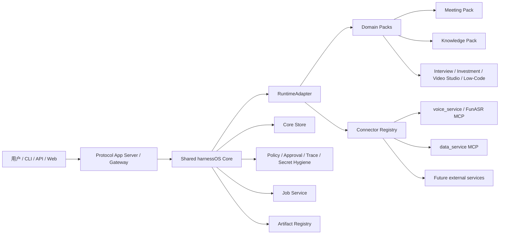
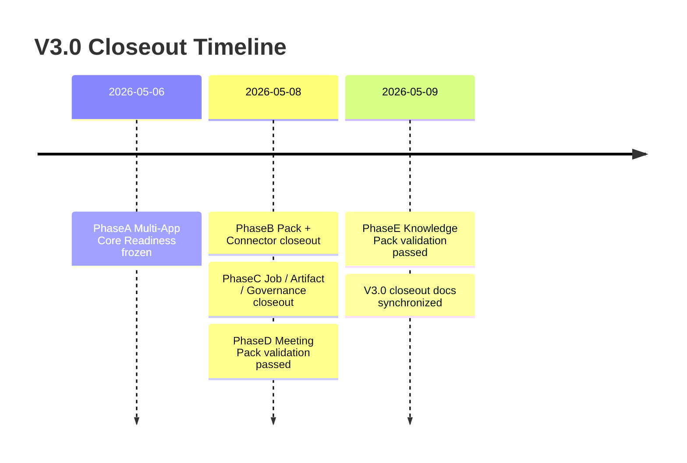
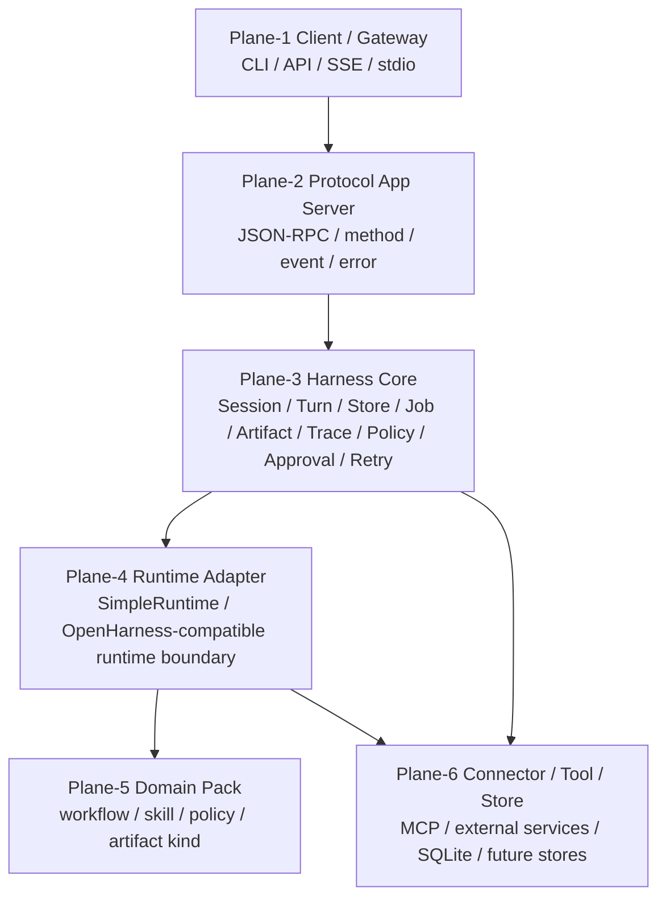
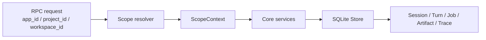
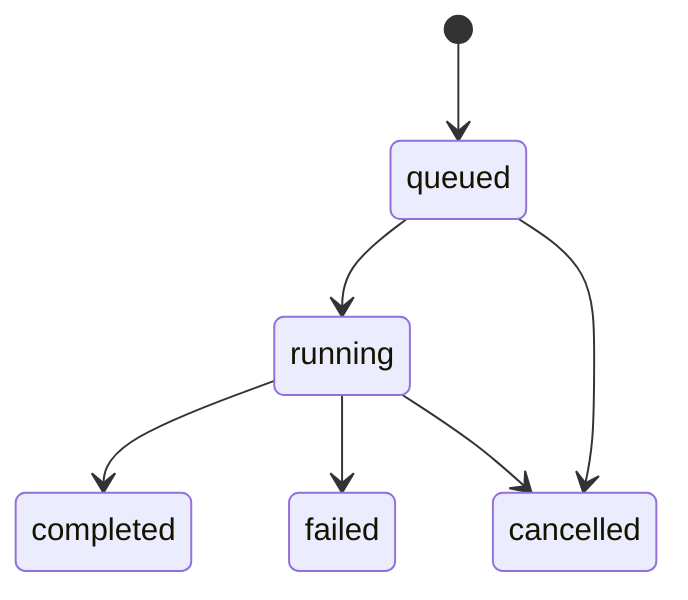
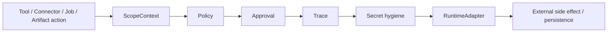
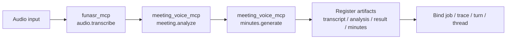
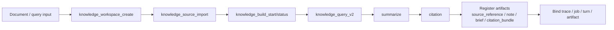
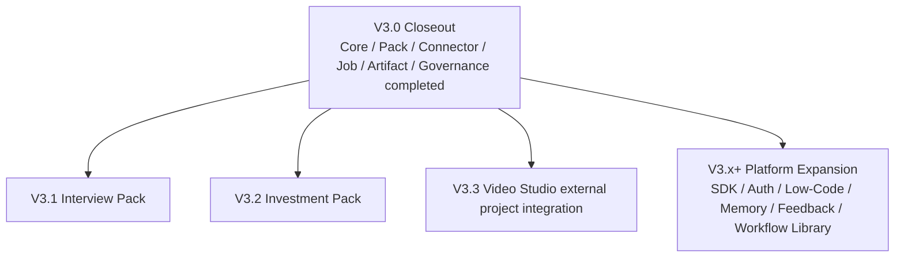

# harnessOS 项目进展介绍

文档状态：V3.0 TEAM INTRODUCTION / CLOSEOUT BRIEF  
更新时间：2026-05-09  
适用对象：新加入团队成员、跨项目协作方、后续 V3.x+ 规划参与者

## 1. 一句话概括

harnessOS 当前已经从“会议 / 知识库等业务助手集合”演进为一个 **CLI-first、协议优先、多 app 复用的 Agent 工作流平台底座**。

V3.0 的核心成果不是把 Meeting 或 Knowledge 做成平台内置业务，而是完成了一套可复用的 Core：

- 多 app 通过 `AppProfile` 和 `ScopeContext` 隔离。
- 业务能力通过 `Pack` 发布，通过 `Connector` 接入外部服务。
- 执行路径统一经过 `RuntimeAdapter`。
- 状态、作业、产物、审计、审批、策略、重试等由共享 Core 承载。
- Meeting / Knowledge 作为 reference packs 验证平台抽象已经通过。

当前结论：**V3.0 PhaseA 到 PhaseE 已完成并进入 closeout 状态。后续新能力应进入 V3.x+，不能再回写为 V3.0 未完成项。**

## 2. 项目目标

harnessOS 的目标是成为一套可组装、可治理、可扩展的 Agent 工作流平台。

它要解决的问题是：

- 不同业务 app 不重复造 Core。
- 新业务不直接改 Gateway / Core。
- 外部能力通过 connector 边界接入，而不是硬编码路径。
- 长任务、产物、trace、approval、policy 有统一语义。
- reference pack 可以证明平台抽象是否真的通用。

长期形态：



## 3. 当前阶段结论

V3.0 已完成，当前不是继续开发 V3.0 平台能力，而是进入 closeout / V3.x+ 规划阶段。

| 阶段 | 状态 | 完成内容 |
| --- | --- | --- |
| V3.0-PhaseA | COMPLETED / FROZEN BASELINE | Multi-App Core Readiness，完成 app profile、scope、store isolation、migration/backfill。 |
| V3.0-PhaseB | COMPLETED / PHASE CLOSEOUT BASELINE | Pack Assembly + Connector Registry，完成 pack 装配合同、connector security descriptor、external pack 和 sample-pack neutrality。 |
| V3.0-PhaseC | COMPLETED / PHASE CLOSEOUT BASELINE | Job / Artifact / Governance Hardening，完成 job 状态机、artifact read/lineage、RuntimeAdapter governance injection。 |
| V3.0-PhaseD | VALIDATION PASSED | Meeting reference pack 验证通过，真实音频、legacy facade 等价、strict/resilience E2E 已完成。 |
| V3.0-PhaseE | VALIDATION PASSED | Knowledge reference pack 验证通过，迁移后的 data_service MCP 真实 E2E 已完成。 |

阶段关系：



## 4. 核心架构

V3.0 采用六大平面分层。核心原则是：入口层只做协议，Core 做平台合同，业务通过 Pack 和 Connector 扩展。



各层职责：

| 平面 | 职责 | V3.0 状态 |
| --- | --- | --- |
| Plane-1 Client / Gateway | CLI、HTTP、SSE、stdio 等入口 | 已稳定，回归保护 |
| Plane-2 Protocol App Server | JSON-RPC、session/turn、events、scope 参数 | 主链路已完成，protocol v1alpha3 / SDK / Auth 转入 V3.x+ |
| Plane-3 Harness Core | 状态、作业、产物、治理、审批、trace、retry | V3.0 Core 合同已完成 |
| Plane-4 Runtime Adapter | 统一执行边界和治理注入点 | RuntimeAdapter governance injection 已完成 |
| Plane-5 Domain Pack | 业务 workflow / skill / policy / artifact 类型装配 | Meeting / Knowledge reference packs 已完成验证 |
| Plane-6 Connector / Tool / Store | 外部能力、MCP、本地工具、持久化 | Connector/security/store 主合同已完成 |

## 5. 关键平台合同

V3.0 最重要的交付物是平台合同，而不是某个单一业务功能。

### 5.1 AppProfile + ScopeContext

多 app 共享一套 Core，但必须通过 scope 隔离：

- `app_id`
- `project_id`
- `workspace_id`

典型链路：



当前状态：

- `session.list/read/transcript/events` 已默认 scope 隔离。
- `turn.start/continue/retry/interrupt` 会复用 session scope 校验。
- `artifact / trace / approval / job / connector job` 相关 RPC 已纳入默认 scope 收口。
- 底层 Store 不传 scope 时仍可全量查询，但该行为只作为受控兼容 / 管理 bypass。

### 5.2 PackAssemblyResult

Pack 是业务能力发布单元。V3.0 已将装配结果冻结为可消费合同：

```text
assembled | blocked | degraded | stub
```

结果包含：

- `app_id`
- `workflows`
- `skills`
- `connector_requirements`
- `policy_bundles`
- `artifact_kinds`
- `missing_dependencies`
- `conflicts`
- `blocked_reason`
- `next_actions`

这意味着：新增业务 pack 不应该改 Core / Gateway，而应该补 manifest、workflow、connector descriptor 和 policy。

### 5.3 ConnectorRegistry

Connector 是外部能力边界，当前已覆盖：

- `meeting_voice_mcp`
- `funasr_mcp`
- `data_service_mcp`
- `local.knowledge`
- 其他 sample / future connectors

Connector descriptor 已稳定输出：

- `trust_level`
- `execution_mode`
- `allowed_commands`
- `allowed_paths`
- `network_policy`
- `secret_ref`
- `app_scope`
- `capabilities`

安全规则：

- stdio connector command/path 必须 allowlist。
- remote connector 受 network policy 约束。
- connector capability 不是授权依据，policy engine 才是授权依据。
- secret 只能传引用，不能落到 manifest、trace 或 artifact 明文。

### 5.4 Job 合同

Job 状态机已冻结：



JobRecord 核心字段：

- `progress`
- `failure_context`
- `artifact_ids`
- `external_job_ref`
- `parent_job_id`
- scope 三元组

关键事实：

- `connector.submit(defer=True)` 是正式后台 job 路径。
- approval-required 路径会复用同一个 connector job。
- MCP `isError=true` 会映射为 failed job。
- `failure_context` 已作为顶层字段写入，同时 metadata 保留兼容镜像。

### 5.5 Artifact 合同

Artifact Registry 现在是正式工件合同，不只是文件登记。

核心能力：

- `artifact.register_external`
- `artifact.read`
- `artifact.read_metadata`
- `artifact.lineage`

读取策略：

| 类型 | `artifact.read` 行为 |
| --- | --- |
| 小型 `text/*` | 允许 inline |
| `application/json` / `.json` | 允许 inline |
| video / audio / image | 阻断全文读取，返回 metadata 建议 |
| binary | 阻断全文读取 |
| external-only | 阻断全文读取 |
| 超阈值文件 | 阻断全文读取 |

统一错误码：

```text
ARTIFACT_READ_BLOCKED
```

Lineage 输出合同：

- `artifacts`
- `edges`
- `roots`
- `leaves`
- `count`

### 5.6 Governance

RuntimeAdapter 已成为正式治理注入边界：



覆盖范围：

- tool invocation
- connector execution
- job write/update
- artifact register/read/lineage

治理结果：

- blocked
- approval-required
- failed
- completed

## 6. Meeting Pack 当前实现

Meeting 是 V3.0-PhaseD 的 reference pack，用于验证真实音频链路、artifact lineage、legacy facade 和严格/韧性模式。

标准链路：



当前实现事实：

- `funasr_mcp` 负责 `audio.transcribe`。
- `meeting_voice_mcp` 负责 `meeting.analyze` 和 `minutes.generate`。
- 真实音频转写优先通过相邻 `voice_service` 的 `funasr_mcp.funasr_recognize_file`。
- strict mode 不允许 silent fallback 掩盖 connector 缺失。
- resilience mode 在 `meeting_voice_mcp` 不可用时允许 fallback，但必须写入 trace 和 artifact metadata。
- fallback 只用于保证 HarnessOS 平台 lineage 验收，不代表 Meeting 业务分析质量完成。
- legacy `meeting.process_recording` 已降级为 compatibility facade，并写入 deprecation warning。

Meeting artifact 四件套：

```text
transcript
analysis
result
minutes
```

Meeting PhaseD 验收结果：

- focused regression：`23 passed, 1 skipped`
- full regression：`193 passed, 3 skipped, 6 warnings`
- preflight：`status=ok`
- resilience real-audio E2E：`status=passed`
- strict real-audio E2E：`status=passed`
- real audio lineage 产出：`transcript / analysis / result / minutes + connector_result`

## 7. Knowledge Pack 当前实现

Knowledge 是 V3.0-PhaseE 的 reference pack，用于验证状态型 connector、data boundary、citation artifacts、connector replacement。

标准链路：



当前实现事实：

- `data_service_mcp` 已通过 ConnectorRegistry 接入。
- 默认路径已迁移到 `/Users/Zhuanz/Desktop/workspace/data_service/backend`。
- 默认解释器优先使用 `/Users/Zhuanz/Desktop/workspace/data_service/backend/.venv/bin/python`。
- HarnessOS 只通过 `data_service_mcp` lifecycle / v2 tools 调用 data_service。
- 不直接读写 data_service 内部 artifact 目录。
- source path 有 allowlist、symlink escape、size limit 检查。
- connector replacement fixture 已验证替换 connector 不改 Core。

Knowledge artifact 四件套：

```text
source_reference
note
brief
citation_bundle
```

Knowledge PhaseE 验收结果：

- focused regression：`32 passed`
- real MCP E2E：`status=passed`
- 默认全量回归：`206 passed, 3 skipped, 6 warnings`
- real MCP E2E 证据：
  - `artifact kinds = source_reference / note / brief / citation_bundle`
  - `lineage_count = 4`
  - `trace_count = 27`
  - `workflow_job_id = job_659f10470de5`

## 8. 当前外部依赖边界

harnessOS 不把 sibling projects 作为 Core 内部实现。它们是 connector 边界外部依赖。

| 外部项目 | 当前角色 | HarnessOS 依赖方式 |
| --- | --- | --- |
| `/Users/Zhuanz/Desktop/workspace/voice_service` | FunASR / audio transcription service | 通过 `funasr_mcp` stdio connector 和 HTTP 服务完成真实音频转写 |
| `/Users/Zhuanz/Desktop/workspace/data_service` | 本地知识库 / GraphRAG + llmwiki 能力 | 通过 `data_service_mcp` stdio connector 调用 lifecycle / v2 tools |
| `/Users/Zhuanz/Desktop/workspace/meeting-voice-assistant` | Meeting 业务分析服务，仍可独立迭代 | 可作为 `meeting_voice_mcp` 外部服务；不可用时不阻塞 HarnessOS 平台 lineage 验收 |

边界原则：

- sibling project 质量不等同于 HarnessOS Core 质量。
- HarnessOS 验证的是 connector contract、job/artifact/trace binding、scope isolation 和治理链路。
- 外部服务真实质量继续由对应项目维护。

## 9. 验收与测试现状

默认验收入口：

- `tests/`
- `scripts/e2e_meeting_validation.sh`
- `scripts/e2e_knowledge_validation.sh`

根目录历史 `test_*.py` 不作为 V3.0 默认验收入口。

关键验收记录：

| 日期 | 范围 | 结果 |
| --- | --- | --- |
| 2026-05-06 | PhaseA baseline | 默认主线和真实音频显式验收通过 |
| 2026-05-08 | PhaseB platform + real services | `15 passed`，显式真实服务均 `status=ok` |
| 2026-05-08 | PhaseC closeout | `182 passed, 3 skipped, 6 warnings` |
| 2026-05-08 | PhaseD Meeting | focused `23 passed, 1 skipped`；strict/resilience E2E 均 passed |
| 2026-05-09 | PhaseE Knowledge | focused `32 passed`；real MCP E2E `status=passed` |
| 2026-05-09 | Full default regression | `206 passed, 3 skipped, 6 warnings` |

## 10. 当前已知后续边界

V3.0 当前无未关闭阻塞项。以下内容属于 V3.x+ 或后续维护：

- Protocol version 仍是 Gateway `v1alpha`；`v1alpha3`、method/event/error registry、SDK/Auth MVP 转入 V3.x+。
- Connector descriptor 数据仍主要在 Python 中声明；manifest/config 外置化转入 V3.x+。
- 底层 Store 无 scope 查询仍作为受控兼容 / 管理 bypass，需要继续防误用。
- Meeting MCP 业务分析质量继续由外部 Meeting 服务迭代，不作为 HarnessOS V3.0 平台阻塞。
- data_service 后续质量、知识库构建性能、GraphRAG/llmwiki 效果属于外部服务质量维护。
- 新增正式执行入口必须继续防治理 bypass。

## 11. 后续路线建议

V3.0 之后，不建议继续在 Core 内堆业务逻辑。推荐路线：



建议优先级：

1. **V3.1 Interview Pack**：验证非 Meeting/Knowledge 的新业务能否只通过 AppProfile + Pack + Connector 扩展。
2. **Protocol / SDK / Auth**：补 `v1alpha3`、method/event/error registry、Python SDK、local capability token。
3. **Connector descriptor 外置化**：减少 Python 内置描述数据，让 connector 更接近独立发布单元。
4. **Video Studio integration**：验证大媒体 artifact policy、long-running job、external render connector。
5. **Low-Code / Workflow Library**：在 Pack/Connector/RuntimeAdapter 合同稳定后再推进。

## 12. 给团队介绍时的推荐讲法

可以按下面顺序讲：

1. **先讲定位**：harnessOS 不是 Meeting App，也不是 Knowledge App，而是多 app Agent 平台 Core。
2. **再讲 V3.0 目标**：让新业务通过 AppProfile / Pack / Connector / RuntimeAdapter 接入，避免继续改 Core/Gateway。
3. **讲六层架构**：Client/Gateway、Protocol、Core、RuntimeAdapter、Domain Pack、Connector/Store。
4. **讲五个阶段**：A scope，B pack/connector，C job/artifact/governance，D meeting 验证，E knowledge 验证。
5. **讲两个 reference pack**：Meeting 证明真实音频和 lineage，Knowledge 证明 data boundary 和 connector replaceability。
6. **讲验收证据**：默认回归 `206 passed`，Meeting strict/resilience passed，Knowledge real MCP passed。
7. **讲边界**：voice_service/data_service 是外部 connector 依赖，meeting-voice-assistant 业务质量不阻塞 HarnessOS 平台验收。
8. **讲后续**：V3.x+ 做 Interview/Investment/Video/SDK/Auth/Low-Code，不回写 V3.0。

## 13. 关键文档索引

- `docs/design/V3.0/CURRENT-STATUS_v3.md`：当前实际状态和 closeout 证据。
- `docs/design/V3.0/current-vs-target-gap_v3.md`：当前实现与目标架构差异、V3.x+ handoff。
- `docs/design/V3.0/current-vs-target-gap_v3.drawio`：当前与目标差异图。
- `docs/design/V3.0/v3_development_plan_multi_app_core.md`：V3.0 final closeout plan。
- `docs/design/V3.0/v3_current_gap_analysis.md`：V3.0 final gap audit / V3.x+ backlog。
- `docs/design/V3.0/acceptance-test-cases_v3.md`：阶段验收标准和测试证据。
- `docs/design/V3.0/test-acceptance-plan_v3.md`：测试验收入口和执行计划。
