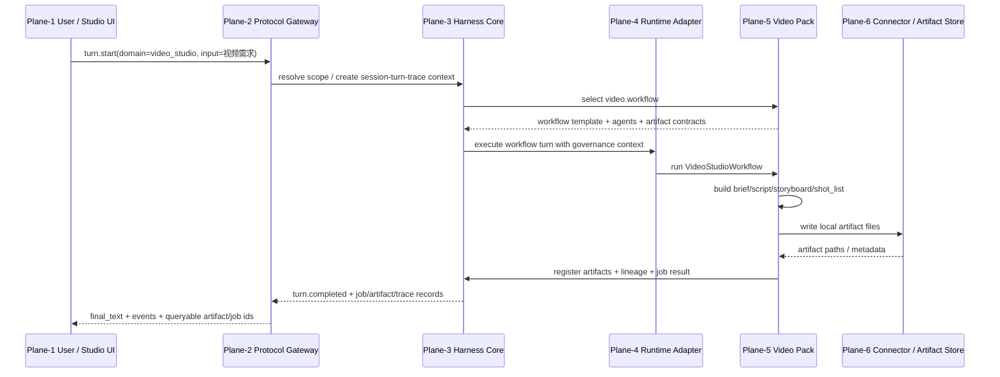
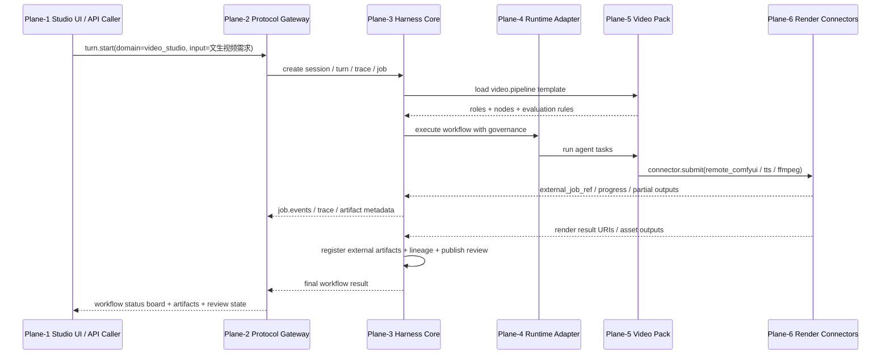

# Video Flow Plane Call Relations V3

文档状态：V3.0 CLOSEOUT ARCHITECTURE EXPLANATION。

本文把 `video_studio` 在当前仓库中的落地实现，映射到 harnessOS 六大平面，并评估该架构对后续 Video / Interview / V4.0 低代码工作流目标的支撑能力。

## 1. 先说结论

- 当前 V3 架构已经能支撑 `video_studio` 的规划型工作流原型：
  - `turn.start(domain=video_studio)`
  - `pack.plan`
  - `workflow.execute_stub`
  - `artifact.lineage`
  - `job.list/get/events`
- 当前已具备：
  - 工作流定义
  - 工位划分
  - 角色声明
  - 规划产物链路
  - Core job / artifact / trace 记录
- 当前尚未完整具备：
  - 真正的远端视频生成执行闭环
  - Studio UI + 工作流控制台
  - 用户可视化微调工作流
  - 用户自然语言自动生成完整 agent/workflow/skill/connector 描述

因此：

- Video Flow V1.0：**可支撑，但还需补远端 connector 执行闭环**
- Video Flow V2.0 / HarnessOS V4.0：**架构方向可支撑，但当前 V3 实现还不够**
- 个人应聘助手 V1.0：**可支撑，适合按新 Pack / 新 AppProfile 方式落地**
- 个人应聘助手 V2.0 + V4.0 低代码工作流：**方向上可支撑，但需要 V4.0 把 Workflow DSL、Agent Descriptor、Console、SDK、嵌套调用协议正式化**

## 2. 相关代码落点

- Video pack manifest：
  [packs/video_studio/manifest.json](/Users/Zhuanz/Desktop/workspace/harnessOS/packs/video_studio/manifest.json)
- Video workflow implementation：
  [packs/video_studio/workflow.py](/Users/Zhuanz/Desktop/workspace/harnessOS/packs/video_studio/workflow.py)
- Gateway workflow registry：
  [apps/gateway/workflows.py](/Users/Zhuanz/Desktop/workspace/harnessOS/apps/gateway/workflows.py)
- Runtime session / adapter path：
  [apps/gateway/runtime.py](/Users/Zhuanz/Desktop/workspace/harnessOS/apps/gateway/runtime.py)
- Runtime adapters：
  [core/runtime_adapter/adapters.py](/Users/Zhuanz/Desktop/workspace/harnessOS/core/runtime_adapter/adapters.py)
- Video lineage / artifact / job regression：
  [tests/test_gateway_protocol.py](/Users/Zhuanz/Desktop/workspace/harnessOS/tests/test_gateway_protocol.py:1185)

## 3. 六大平面在 Video Flow 中各自做什么

| 平面 | 在 Video Flow 中的职责 | 当前对应实现 |
| --- | --- | --- |
| Plane-1 Client / Gateway | 接收用户请求、展示工作流结果、提供 Studio UI/BFF 入口 | `turn.start`、未来 Studio UI |
| Plane-2 Protocol App Server | 标准化 RPC/stream 调用，解析 `domain/app/scope`，暴露 `pack/workflow/job/artifact` 方法 | `GatewayService` / RPC methods |
| Plane-3 Harness Core | 保存 session/turn/job/artifact/trace/policy/approval/retry；管理 lineage 和治理证据 | `CoreAppService`、SQLite Store、artifact lineage |
| Plane-4 Runtime Adapter | 把执行请求交给具体 runtime，隔离 `simple` / `openharness` / future runtime 差异 | `SimpleRuntimeAdapter`、`OpenHarnessRuntimeAdapter` |
| Plane-5 Domain Pack | 定义视频业务流程、工位、角色、产物合同、评估规则 | `packs/video_studio/manifest.json` |
| Plane-6 Connector / Tool / Store | 调用远端模型、渲染服务、TTS、FFmpeg、外部素材服务 | 当前 `remote_comfyui` scaffold，未来 video connectors |

## 4. Video Flow 调用时序图

### 4.1 当前规划型 Video Flow

### 4.2 未来远端生成型 Video Flow V1.0

## 5. 工作流创建、工位划分、角色区分、产出管理、执行、评估分别落在哪个平面

### 5.1 工作流创建

当前 `video.workflow` 和 `video.pipeline` 定义在 [packs/video_studio/manifest.json](/Users/Zhuanz/Desktop/workspace/harnessOS/packs/video_studio/manifest.json:8)。

所以：

- 创建者：`Plane-5 Domain Pack`
- 触发者：`Plane-1/Plane-2`
- 记录者：`Plane-3`

当前 `workflow_dsl` 已定义：

- `brief`
- `script`
- `storyboard`
- `render_manifest`

当前 `workflow_templates.video.pipeline` 已定义 DAG 节点：

- `brief`
- `script`
- `direction`
- `storyboard`
- `render_manifest`
- `publish_review`

### 5.2 工位划分

当前工位直接等于 workflow node owner：

- `studio.lead`
- `scriptwriter`
- `director`
- `storyboarder`
- `editor`
- `qa.publisher`

它们定义在 [packs/video_studio/manifest.json](/Users/Zhuanz/Desktop/workspace/harnessOS/packs/video_studio/manifest.json:42)。

因此：

- 工位定义：`Plane-5`
- 工位执行：`Plane-4`
- 工位结果记录：`Plane-3`

### 5.3 AI 角色区分

每个角色包含：

- `role`
- `goal`
- `tool_refs`
- `skill_refs`
- `memory_scope`
- `handoff_targets`

例如：

- `studio.lead` 负责把用户意图转为 brief
- `scriptwriter` 负责脚本
- `director` 负责视觉方向
- `storyboarder` 负责分镜与镜头拆解
- `editor` 负责 render manifest
- `qa.publisher` 负责交付前质量审核

角色定义来自 `Plane-5`，真正交给什么 runtime 执行来自 `Plane-4`。

### 5.4 产出管理

当前视频流已经有标准产物链：

- `brief`
- `script`
- `storyboard`
- `shot_list`
- `asset_plan`
- `render_output`
- 未来 `publish_report`

在当前实现里，产物由 [packs/video_studio/workflow.py](/Users/Zhuanz/Desktop/workspace/harnessOS/packs/video_studio/workflow.py:25) 生成并登记。

产物管理职责属于 `Plane-3`：

- 记录 artifact kind
- 记录 owner session / turn
- 记录 parent_ids
- 提供 `artifact.lineage`
- 关联 job / trace / turn

当前自动化用例已经验证：
`brief -> script -> storyboard -> shot_list -> asset_plan -> render_output`
见 [tests/test_gateway_protocol.py](/Users/Zhuanz/Desktop/workspace/harnessOS/tests/test_gateway_protocol.py:1225)。

### 5.5 任务流执行

当前执行链路是：

1. `Plane-1` 用户发出视频需求
2. `Plane-2` 通过 `turn.start(domain=video_studio)` 标准化请求
3. `Plane-3` 建立 turn/job/trace/artifact 上下文
4. `Plane-5` 选择 `video.workflow`
5. `Plane-4` 把执行请求交给对应 runtime
6. `Plane-5` 的 workflow 生成规划结果
7. `Plane-6` 在需要外部 connector 时提供能力
8. `Plane-3` 统一登记结果并可回查 lineage / jobs / traces

### 5.6 工作流效用评估

当前仓库里，评估还不是完整产品，但已经有三类基础：

1. Pack 级评估规则  
   见 [packs/video_studio/manifest.json](/Users/Zhuanz/Desktop/workspace/harnessOS/packs/video_studio/manifest.json:115)

   - `required_connectors_present`
   - `required_connector_capabilities_present`
   - `artifact_lineage_complete`
   - `render_manifest_contract_only`
   - `publish_report_required_before_external_delivery`

2. Core 级治理与证据  
   由 `Plane-3` 提供：

   - job state
   - trace
   - artifact lineage
   - publish review 记录

3. 角色级 QA 节点  
   `qa.publisher` 本身就是一个交付前评估工位。

所以将来“质量看板”最自然的做法就是：

- `Plane-5` 声明评估规则和 QA 节点
- `Plane-3` 汇总 job/artifact/trace evidence
- `Plane-1` 以 Studio UI 展示质量看板

## 6. 当前 V3 对目标视频能力的实际支撑程度

### 6.1 视频工作流 V1.0：远端调用模型输出生成视频

目标：

- 支持文生视频
- 调用远端模型或远端渲染服务
- 产出最终视频或镜头片段

当前支撑情况：**部分支撑**

已经具备：

- `video_studio` 作为独立 domain / app 入口
- workflow / agent / connector / artifact 合同雏形
- `remote_comfyui` connector scaffold
- `asset_plan`、`render_output` 产物链
- job / trace / artifact 注册基础

还缺：

- 真正的远端 connector submit / poll / cancel / collect 闭环用于视频生成
- `artifact.register_external` 或等价外部 URI 产物登记能力
- 大视频二进制的 metadata-only / preview / thumbnail / range 读取能力
- 长任务失败恢复、超时、重试和取消的正式策略
- 对 TTS / 配音 / 素材检索 / FFmpeg 编排的标准 connector 化

结论：

- **能支撑 V1.0 原型和服务侧主链路设计**
- **不能直接宣称当前仓库已经完成“远端调用模型输出视频”**

### 6.2 视频工作流 V2.0：HarnessOS V4.0 重构为 Studio UI + 工作流控制台

目标：

- Studio UI
- 工作流控制台
- 服务侧能力编排
- 工作流状态可观测

当前支撑情况：**架构上可支撑，V3 实现尚不充分**

原因：

- `Plane-1/2/3/4/5/6` 的分层本身非常适合做 Console：
  - `Plane-1` 负责 Studio UI
  - `Plane-2` 提供统一 RPC / stream / SDK
  - `Plane-3` 提供 workflow/job/artifact/trace 状态事实
  - `Plane-5` 提供 workflow/agent/connector 描述
- 但当前还缺：
  - 工作流编辑器可消费的正式 schema
  - agent / connector / skill descriptor 的稳定输出格式
  - 前端控制台使用的 SDK / schema registry
  - workflow execution board / quality board API
  - 多 app / 多项目级鉴权、嵌套调用、外部嵌入协议

结论：

- **V4.0 很适合基于这套架构做 Studio UI + Workflow Console**
- **但前提是把 V3 的 Pack/Connector/Artifact/Governance 合同冻结完**

## 7. 当前 V3 对个人应聘助手目标的支撑程度

### 7.1 个人应聘助手 V1.0

目标：

- 前后端产品定义清晰
- 后端 MCP 化改造
- 抽取多个工作流

当前支撑情况：**可以支撑**

原因：

- 应聘助手天然适合作为一个新 app / 新 pack：
  - `app_id=interview`
  - 独立 `interview` pack
  - 独立 workflow templates
  - 独立评估 artifacts：简历分析、岗位匹配、模拟问答、评分报告、改进建议
- 当前架构已经支持：
  - AppProfile
  - Pack manifest
  - 多 workflow
  - artifact lineage
  - job / trace / evaluation evidence

还缺：

- `interview` 当前仍偏 stub，需要从 stub 升级为 active pack
- 简历解析、JD 分析、模拟面试、录音转写、报告生成等 MCP connectors 需要正式化
- 面试评估规则和 report artifacts 需要产品定义先冻结

结论：

- **应聘助手 V1.0 非常适合按当前 V3 体系落地**

### 7.2 个人应聘助手 V2.0：HarnessOS V4.0 重构

目标：

- 有独立 UI
- 用户可调 workflow
- 后端工作流可编排、可复用、可嵌入

当前支撑情况：**方向上支撑，仍需 V4.0 产品化能力**

真正需要 V4.0 补齐的点：

- 工作流控制台
- Agent Descriptor Schema
- Connector Descriptor Schema
- Workflow DSL Editor / Compiler
- Prompt/Skill/Policy 的版本化
- 外部系统嵌入 harnessOS 子工作流的标准协议

## 8. 对“用户自然语言生成工作流”的支撑判断

你举的例子本质上是在要求平台支持：

1. 用户输入自然语言目标
2. 平台自动生成：
   - 工位
   - Agent 描述
   - Skill / MCP 能力集
   - 产出结构
   - 质量要求
   - 质量看板
3. 用户可微调这条流水线
4. 用户还能把这条流水线嵌入自己的项目

这已经不是单一 Video Flow，而是 **Workflow-as-Product / Workflow-as-Platform**。

当前架构对这个方向的支撑判断是：

- **目标方向是正确的**
- **V3 分层是必要前提**
- **但必须到 V4.0 才适合把它正式产品化**

原因如下。

### 8.1 为什么说 V3 架构方向是对的

因为这件事天然需要六层分离：

- `Plane-1`：工作流控制台、看板、嵌入式 UI
- `Plane-2`：workflow generation / editing / execution API
- `Plane-3`：workflow state、job、artifact、quality evidence、feedback history
- `Plane-4`：执行器可替换，避免把生成型平台绑死在一个 runtime
- `Plane-5`：workflow、agent、skill、policy、artifact schema 都应该是 Pack/Descriptor
- `Plane-6`：MCP / external model / render / search / storage connectors

也就是说，如果没有现在这套分层，后面很难做“用户自然语言生成 workflow”。

### 8.2 为什么当前 V3 还不够

因为现在还缺少“可生成、可编辑、可保存、可嵌入”的正式描述层：

- workflow schema 还不是面向 Console 的正式 DSL
- agent schema 还不够稳定
- skill / connector descriptor 还没完全外置
- quality board 还没有正式 contract
- nested harnessOS embedding 还没有正式 protocol

### 8.3 V4.0 需要新增什么

若要支撑你说的目标，V4.0 至少需要这些能力：

1. Workflow Generation Layer
- 把自然语言需求转成 workflow template
- 自动生成工位、agent goals、tool refs、artifact kinds、evaluation rules

2. Workflow Editing Layer
- 用户在前端修改节点、边、角色、技能、质量规则
- 变更后重新编译成 Pack / Workflow Descriptor

3. Quality Board Layer
- 对每个节点输出质量指标
- 展示 artifact completeness、review score、policy violations、connector failures

4. Embedded HarnessOS Layer
- 某个外部项目可把 harnessOS workflow 当作内嵌子系统
- 通过 RPC / SDK / iframe / BFF / nested app server 使用

5. Versioned Descriptor System
- Agent descriptor
- Workflow descriptor
- Skill descriptor
- Connector descriptor
- Evaluation rule descriptor

## 9. 最终结论

对你列出的开发目标，结论可以压成一句话：

- 当前目标架构 **能支撑这些方向**
- 当前 V3 实现 **只够支撑其中的 V1 原型和部分服务侧底座**
- 如果要真正做成“用户可生成、可微调、可嵌套”的 AI 工作流平台，**必须把 HarnessOS V4.0 建成 Workflow Console + Descriptor Platform**

更具体地说：

- 视频工作流 V1.0：**可做**
- 视频工作流 V2.0：**可做，但依赖 V4.0 控制台与描述层**
- 个人应聘助手 V1.0：**可做，而且很适合先做**
- 个人应聘助手 V2.0：**可做，但应作为 V4.0 平台化样板之一**
- 用户自然语言生成复杂工作流并微调：**这是 V4.0 的核心产品目标，不是当前 V3 的直接完成项**

## 10. 推荐实施顺序

1. 先完成 V3.0-PhaseB / C，冻结 Pack / Connector / Job / Artifact / Governance 合同。
2. 先把视频和应聘助手都落成 “active pack + connectorized workflow”，不要先急着做低代码前端。
3. 把视频工作流 V1.0 和应聘助手 V1.0 作为两个真实业务样板。
4. 基于两个样板抽象 V4.0 的：
   - workflow descriptor
   - agent descriptor
   - evaluation board
   - Studio UI / workflow console
5. 再做“自然语言生成 workflow + 用户微调 + 嵌套使用”的平台化能力。
