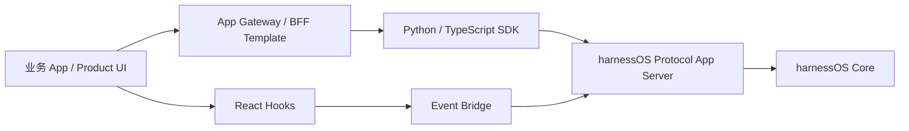

# V3.5 Project Introduction Baseline

文档状态：V3.5 team introduction baseline。

## 1. One Sentence

harnessOS V3.5 的目标是建设 Application Adaptation Layer，让外部业务 App 通过 SDK、BFF、hooks、event bridge、templates 和 embed contract 接入 harnessOS，而不是直接修改 Core。

## 2. Current Stage

当前阶段是 V3.5 规划与后续实施准备阶段。重点工作已经从平台 Core 建设切换到外部 App 接入：

- 协议 schema 化。
- 本地 capability token。
- 浏览器事件订阅。
- Python / TypeScript SDK。
- React hooks。
- BFF template。
- Pack / Connector template。
- Embed contract。
- Reference app example。

## 3. Why V3.5 Exists

V3.5 要回答的问题是：

- 后端服务如何稳定调用 harnessOS。
- 前端如何订阅事件并展示 job / artifact / approval。
- 新业务如何生成 pack 和 connector。
- 嵌入式 Agent 面板如何与 session / turn / event / artifact 合同对齐。
- 外部 App 如何在 scope 和 capability token 下安全运行。
- 原生 EventSource 如何在不能设置 Authorization header 的情况下安全订阅事件。

## 4. V3.5 Architecture Narrative

## 5. Team Guidance

- 新业务需求优先判断是否能通过 SDK + BFF + Pack + Connector 接入。
- 如果必须改 Core，先记录平台缺口，不要把业务旁路作为长期方案。
- V3.5 文档和代码必须保留 dev/local-first 与 formal external app support 的边界。
- 不要把业务 reference path 的 legacy path 当成 SDK/BFF 默认模板。
- Reference app 必须保持平台中立，不依赖 Meeting/Knowledge pack 或 legacy RPC。
