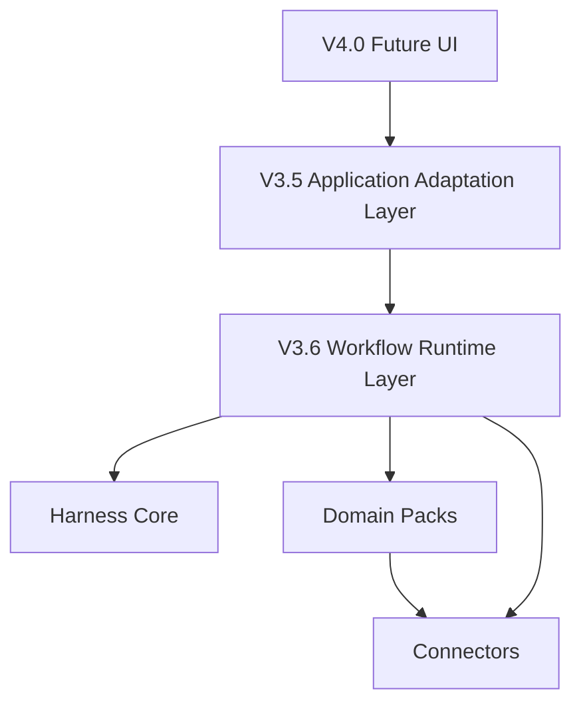

# V3.6 Project Introduction Baseline

文档状态：V3.6 team introduction baseline。

## 1. One Sentence

harnessOS V3.6 的目标是建设 Workflow Runtime Contract & Pipeline Operating Model，让工作流流水线成为可运行、可追踪、可审批、可评价、可被 UI 消费的一等对象。

## 2. Current Stage

当前阶段是 V3.6-J Dummy Pipeline E2E / V4.0 Gate 已完成 targeted implementation and focused regression。V3.5 已完成 dev/local Application Adaptation Layer；V3.6 已具备 template/draft/version service、deterministic dummy workflow runtime、workflow approval point、artifact contract / lineage binding、quality evaluation MVP、board/status/output summary API、business context、safe workflow patch，以及平台中立 dummy pipeline E2E。下一步可以进入 V4.0 Workflow Studio / AgentTalkWindow 正式开发计划，但仍不能声明 V4.0 complete。

重点工作包括：

- WorkflowTemplate / WorkflowVersion。
- WorkflowInstance。
- Station / StationRun。
- ArtifactContract / lineage binding。
- Approval point。
- QualityEvaluation。
- Pipeline Board API。
- Business Event / Workflow Context。
- WorkflowPatch / Agent editing contract。
- Dummy Pipeline E2E。

## 3. Why V3.6 Exists

V3.5 已回答“业务 App 如何接入 harnessOS”。V3.6 要回答：

- 一个业务流水线如何被定义为版本化模板。
- 一次 workflow 运行如何被追踪。
- 每个 station 如何绑定 job、artifact 和 trace。
- 人工审批点如何进入工作流。
- 质量评估如何成为平台事实，而不是 UI 字段。
- V4.0 Station Board 如何不依赖 mock schema 重建状态。
- Agent 如何安全地提出 workflow 修改，而不是直接改 published workflow。

## 4. Architecture Narrative

## 5. Team Guidance

- V4.0 正式 UI 开发前，先检查 V3.6-J gate 是否通过。
- 新增 workflow 能力优先进入 V3.6 runtime contract，不要做 UI 专用后端旁路。
- Agent 只能 propose patch；apply 必须进入 draft；published workflow 不能被静默修改。
- Dummy pipeline 必须平台中立，不依赖 Meeting / Knowledge / Video / external MCP。
- Board API 必须返回可消费事实，不返回敏感 token 或 raw trace payload。
