# V4.0 Workflow Console 手工操作与验收指南

Status: local manual validation guide with screenshot evidence.

Scope: dev/local Workflow Console. Forbidden claims / No False Green: 本指南用于人工检查 V4.0 当前功能，不表示 production-ready，不表示完整 Workflow Studio，不表示 Agent executor ready。

Local URL: http://127.0.0.1:4174/

Screenshot Evidence Directory:

docs/design/V4.0/manual-guide-screenshots/

## 操作前提

1. 本机 BFF 已运行在 18040。
2. 本机 Workflow Console 已运行在 4174。
3. 浏览器打开 http://127.0.0.1:4174/。
4. 当前数据来自 dev/local BFF fixture，适合人工验收，不适合生产声明。

## Step 1 打开 Workflow Console

操作：

1. 在 Chrome 打开 http://127.0.0.1:4174/。
2. 确认页面显示三栏布局：左侧节点库，中间工作流画布，右侧画布助手。
3. 确认顶部显示 Workflow Studio 标题、版本、工作流选择区和运行测试按钮。

期望结果：

1. 页面能正常加载，不显示真实数据连接失败。
2. 右下角状态显示事件连接状态。
3. 画布助手默认处于提案模式。

Evidence:

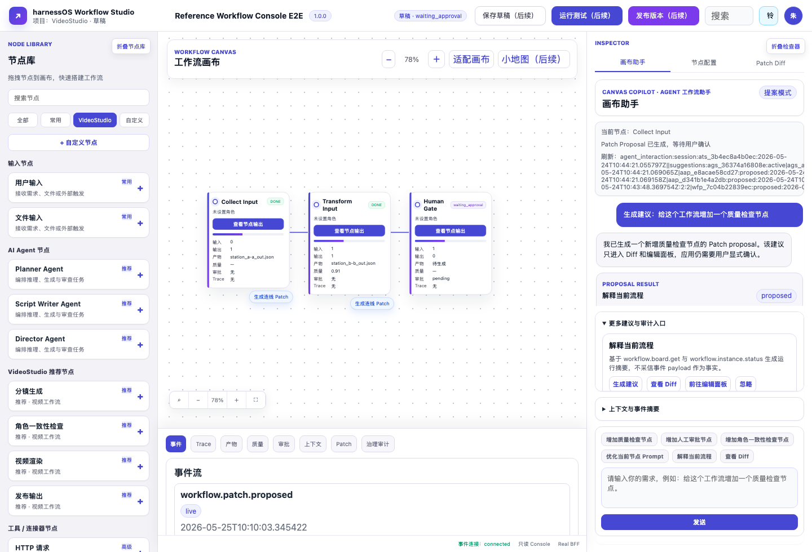

## Step 2 选择已部署的简单工作流

操作：

1. 使用顶部工作流选择器选择已部署的 dev/local workflow。
2. 确认实例选择器自动定位到对应 workflow instance。
3. 观察顶部状态，例如草稿 waiting_approval。

期望结果：

1. workflow template、workflow version、workflow instance 都能加载。
2. 不出现跨 scope 访问失败。
3. 当前页面仍通过 BFF DTO 展示数据。

Evidence:

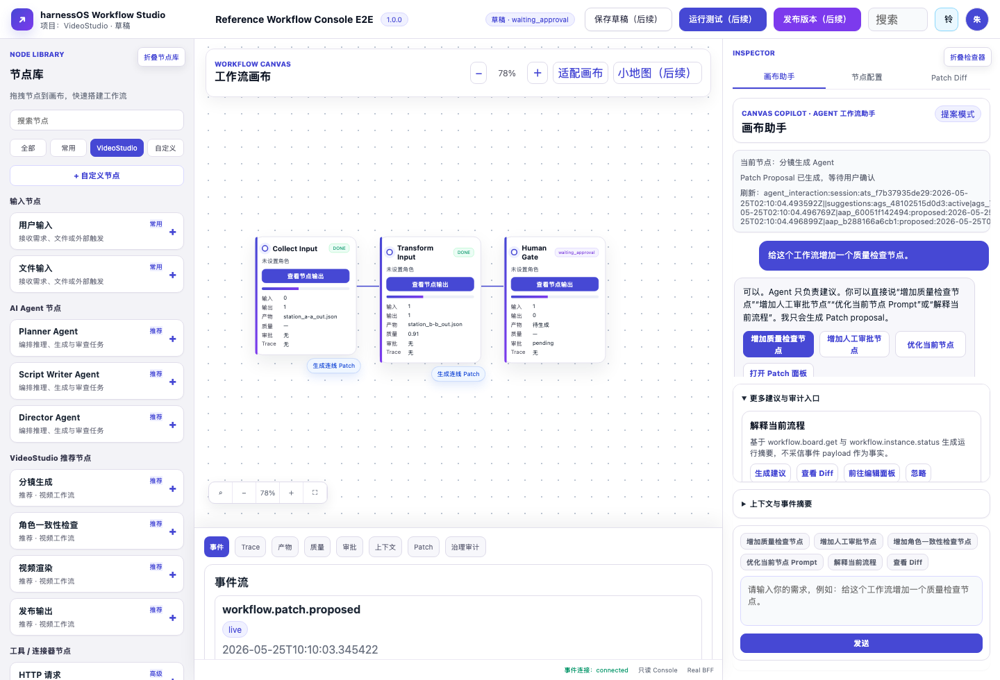

## Step 3 检查工作流画布

操作：

1. 查看中间画布。
2. 确认至少有输入、转换、人工门禁等节点。
3. 使用画布缩放和适配画布按钮，确认不会破坏节点展示。

期望结果：

1. 节点卡片展示运行状态、输入输出、产物、质量、审批和 Trace 摘要。
2. 连线只作为画布投影展示。
3. 画布本身不直接写 runtime truth。

Evidence:


## Step 4 检查运行产物

操作：

1. 点击底部 产物 标签。
2. 查看 artifact panel。
3. 确认能看到当前 workflow run 的产物摘要。

期望结果：

1. 产物列表非空。
2. 页面不展示 raw_artifact_content。
3. 产物信息来自 BFF redacted DTO。

Evidence:

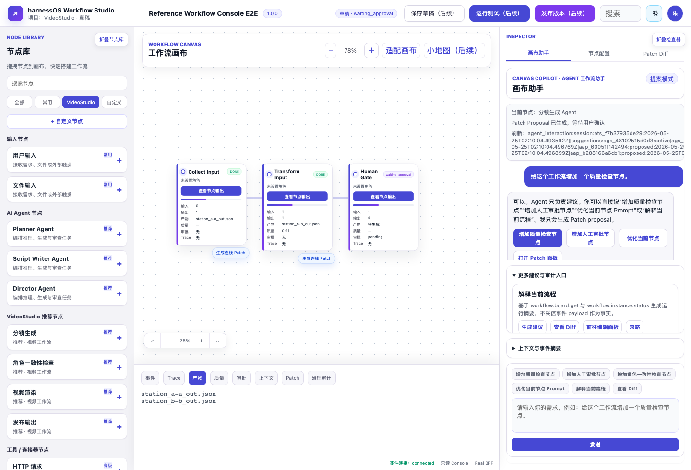

## Step 5 检查 Trace 摘要

操作：

1. 点击底部 Trace 标签。
2. 查看 trace panel。
3. 确认只显示 redacted trace summary。

期望结果：

1. 不展示 raw_trace_payload。
2. 不展示 capability_token、subscription_token、Authorization 或 Bearer。
3. Trace 仅用于观察，不触发 mutation。

Evidence:

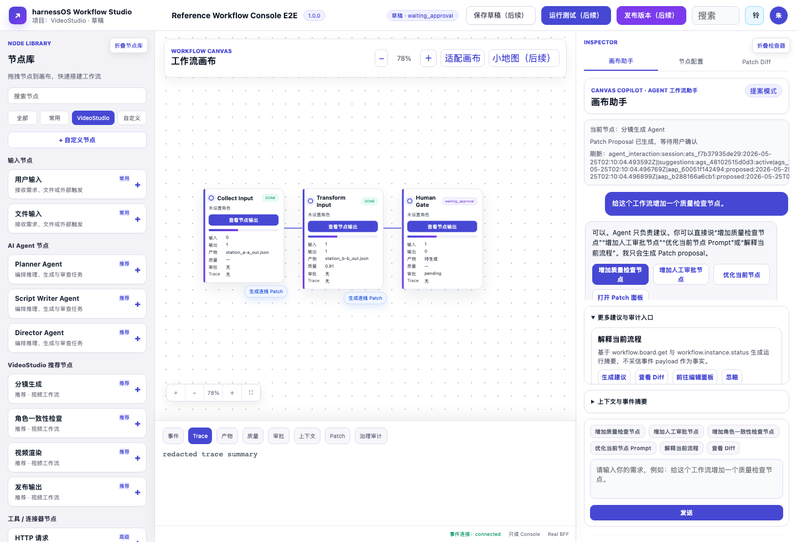

## Step 6 打开画布助手

操作：

1. 点击右侧 Agent 助手 或 画布助手 tab。
2. 观察聊天式 Canvas Copilot 界面。
3. 确认右侧显示当前节点、提案模式和快捷按钮。

期望结果：

1. 画布助手表现为聊天框界面。
2. 用户能输入自然语言调整请求。
3. 页面文案说明 Agent 只负责建议。

Evidence:


## Step 7 输入工作流调整请求

操作：

1. 在画布助手输入框输入：给这个工作流增加一个质量检查节点。
2. 暂不点击发送，先确认输入内容保留在输入框。
3. 可验证 Enter 发送，Shift Enter 换行。

期望结果：

1. 输入行为只更新本地输入框。
2. 未发送前不生成 patch。
3. 未发送前画布不新增真实节点。

Evidence:

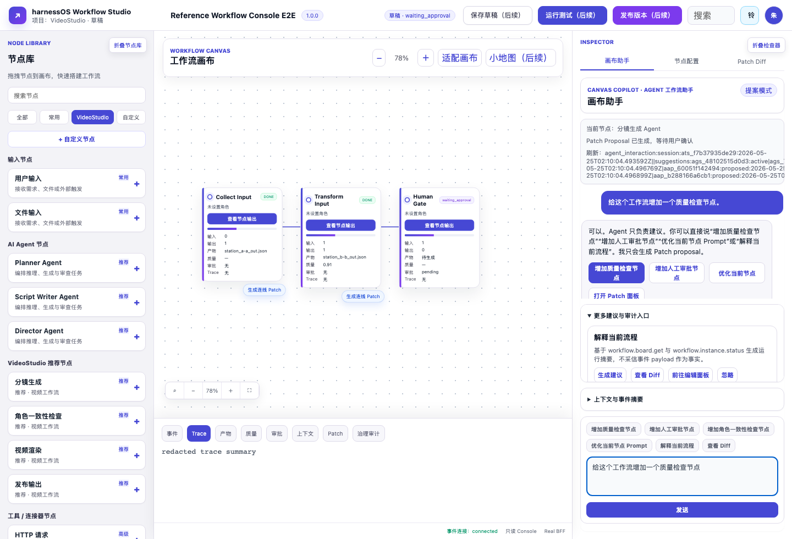

## Step 8 发送请求并查看 Agent Proposal

操作：

1. 点击发送。
2. 等待画布助手返回 proposal。
3. 在 Proposal Result 或更多建议区域查看新增质量检查节点建议。

期望结果：

1. Agent 只生成 Patch proposal。
2. 新节点在 apply 前不能出现在真实画布节点中。
3. 右侧提供查看 Diff、前往编辑面板、忽略等用户操作入口。

Evidence:

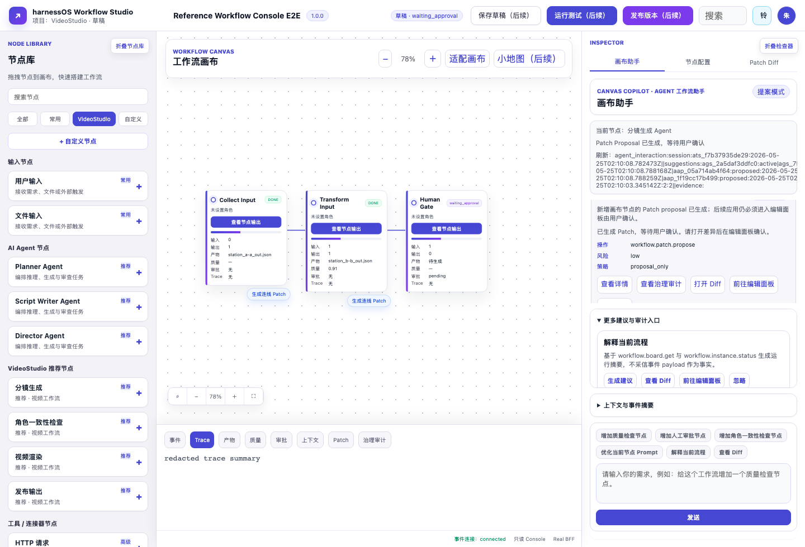

## Step 9 进入 Patch 面板并审查 Diff

操作：

1. 点击新增质量检查节点 proposal 中的 前往编辑面板。
2. 查看 Patch Diff 面板。
3. 检查 operation 为 add_station，并确认包含质量检查节点。

期望结果：

1. Patch 状态为 proposed。
2. Diff 显示新增节点内容。
3. apply 前画布节点数量保持不变。
4. 执行入口仍是用户确认按钮，不是 Agent 自动执行。

Evidence:

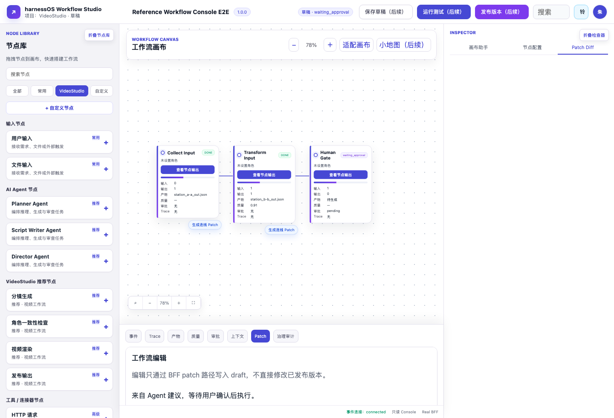

## Step 10 用户确认应用 Patch 并刷新画布

操作：

1. 点击 应用到草稿。
2. 接受浏览器确认弹窗。
3. 等待画布刷新。
4. 检查新增的质量检查节点是否出现在画布中。

期望结果：

1. POST body 应包含 user_confirmed=true 和 source=editing_panel。
2. 新节点只在 apply 成功后出现。
3. 画布从 BFF truth 刷新，不从事件 payload 构造 truth。

Evidence:

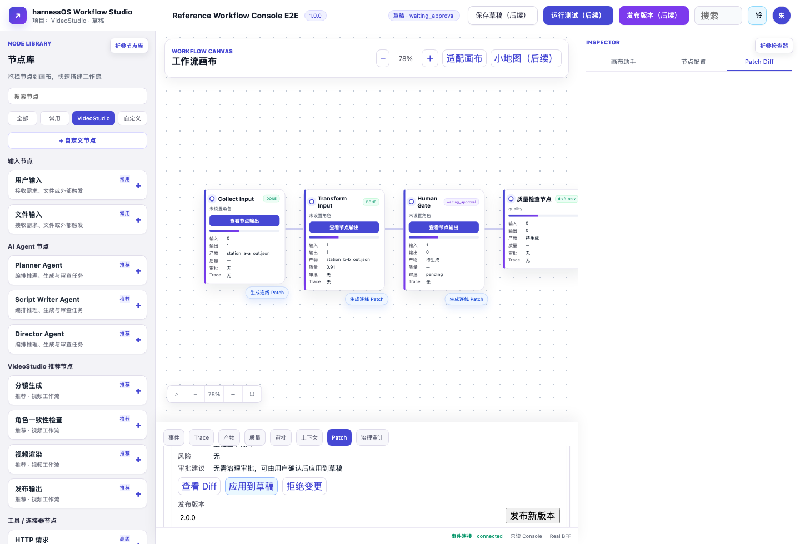

## Step 11 检查节点配置输入只产生本地 dirty state

操作：

1. 点击任一节点的 查看节点输出。
2. 打开右侧 节点配置 tab。
3. 在 Prompt Patch 输入框输入修改建议。
4. 输入期间不要点击生成 Patch。

期望结果：

1. 输入只更新本地 dirty state。
2. 输入期间不应发起 proposal 请求。
3. 生成 Patch 按钮在存在选中节点和输入内容后可用。

Evidence:

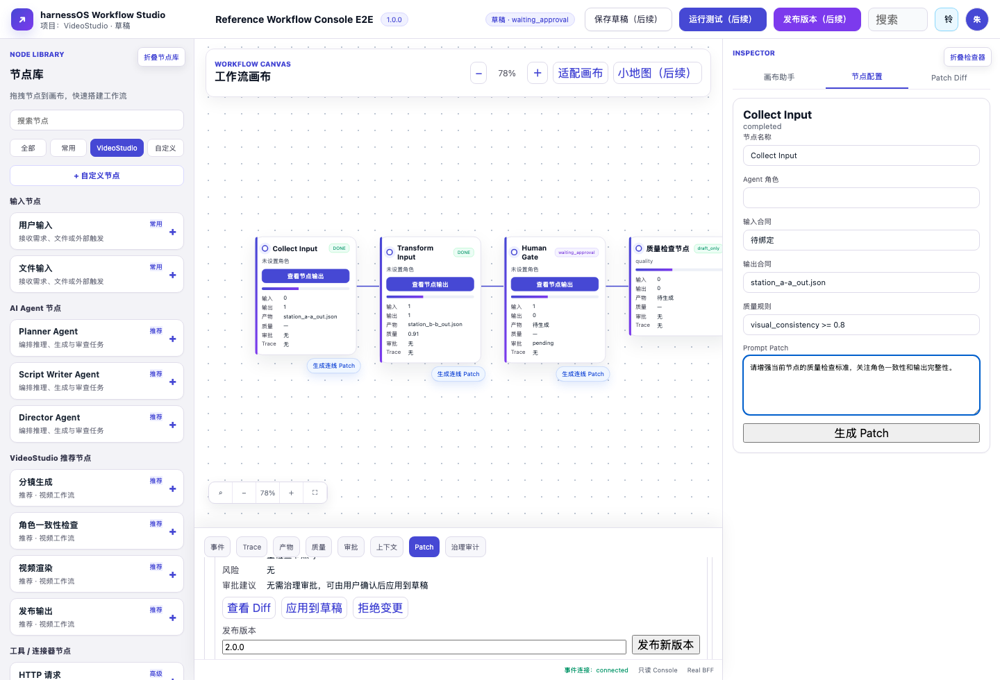

## Step 12 通过节点配置生成 Patch

操作：

1. 点击节点配置中的 生成 Patch。
2. 等待 Patch Diff 面板打开。
3. 查看 prompt 更新 patch。

期望结果：

1. 点击一次生成 Patch，只发送一次 proposal 请求。
2. payload 不包含 x、y、zoom、viewport、selectedNode、panelCollapsed、activeTab。
3. token、raw trace、raw artifact、raw connector payload 不进入 proposal。

Evidence:

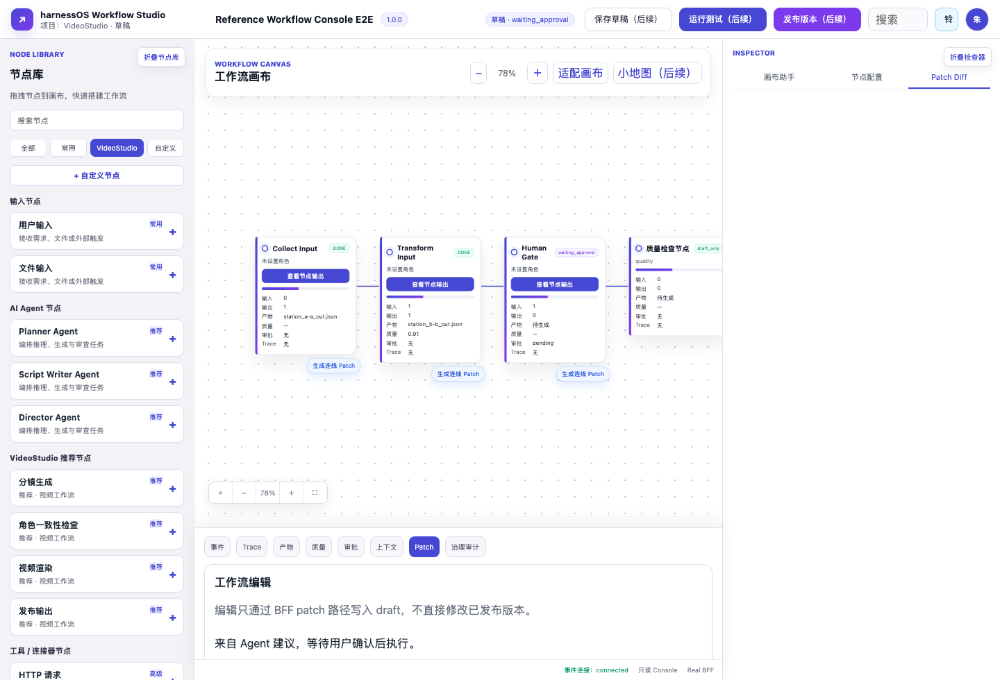

## Step 13 检查审批面板

操作：

1. 点击底部 审批 标签。
2. 查看 Approval Panel。
3. 如存在待审批项，确认批准和拒绝需要用户手动点击。

期望结果：

1. Agent 不会自动 approval.respond。
2. 审批动作需要用户显式确认。
3. 不出现自动应用、自动发布、Agent 已执行、Agent 已发布等文案。

Evidence:

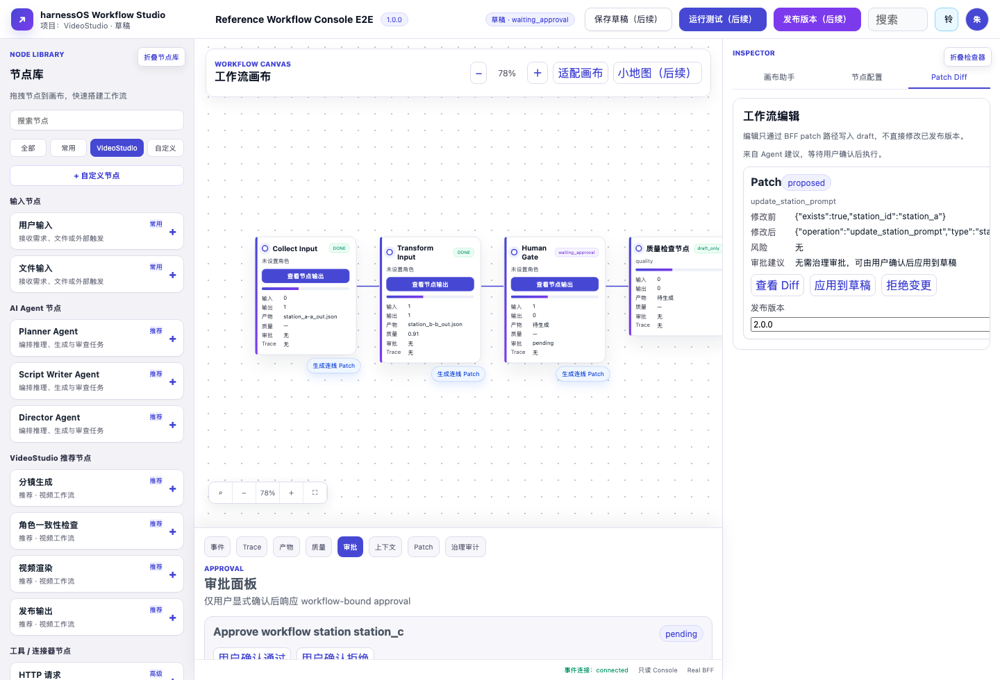

## Step 14 检查上下文面板

操作：

1. 点击底部 上下文 标签。
2. 查看业务上下文摘要。
3. 如需修改上下文，只能通过 Context Panel 的用户确认入口。

期望结果：

1. context.update 不由 Agent 自动执行。
2. business.event.emit 不由 Agent 自动执行。
3. 上下文 DTO 不泄露 secret 或 raw payload。

Evidence:

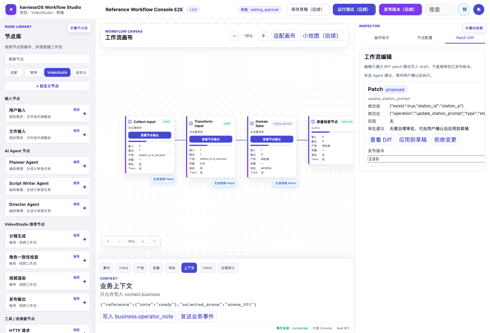

## Step 15 检查治理审计证据链

操作：

1. 点击底部 治理审计 标签。
2. 查看 evidence chain。
3. 检查证据数量、交接数量、成功和阻断状态。

期望结果：

1. 治理审计为只读。
2. 证据链可以显示 proposal、handoff、用户确认和运行结果。
3. 不出现执行类按钮，例如 Execute、Run、Apply by Agent、Publish by Agent。

Evidence:

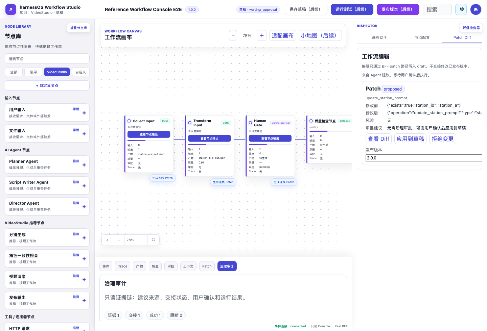

## Step 16 检查 Agent 只读解释和摘要

操作：

1. 返回画布助手。
2. 输入：解释当前流程并总结最近事件。
3. 点击发送并观察回复。

期望结果：

1. explain workflow 和 summarize events 是只读行为。
2. 只读解释不创建 handoff，不自动 apply，不自动 publish。
3. EventBridge 事件只触发 refresh，不作为 UI truth。

Evidence:

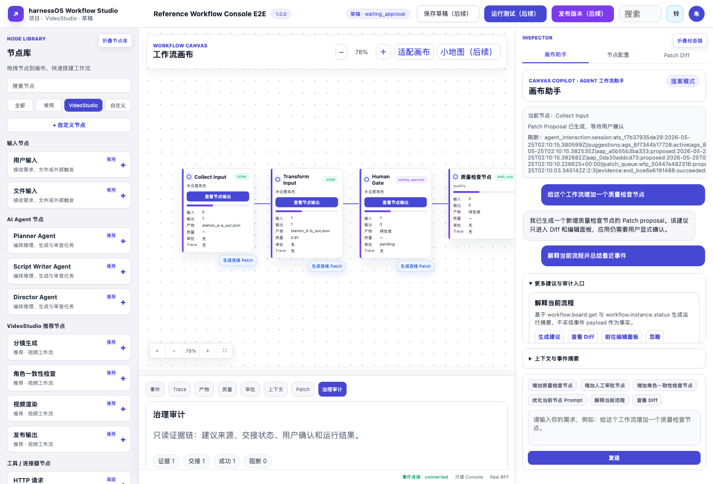

## 人工验收清单

请按以下项目逐项检查并记录结果。

| ID | 检查项 | 期望结果 | 证据截图 | 结果 |
| --- | --- | --- | --- | --- |
| M01 | 页面加载 | 控制台正常显示三栏布局 | Step 1 | 待检查 |
| M02 | 工作流选择 | workflow/template/instance/status 正常加载 | Step 2 | 待检查 |
| M03 | 画布展示 | 节点、连线、状态、产物摘要可见 | Step 3 | 待检查 |
| M04 | 产物面板 | 产物列表可见且不泄露 raw_artifact_content | Step 4 | 待检查 |
| M05 | Trace 面板 | 只显示 redacted trace summary | Step 5 | 待检查 |
| M06 | 画布助手 | 聊天式输入、快捷按钮、提案模式可见 | Step 6 | 待检查 |
| M07 | 输入行为 | 未发送前不生成 patch，不改画布 | Step 7 | 待检查 |
| M08 | Agent proposal | 发送后只生成 proposal，不直接新增节点 | Step 8 | 待检查 |
| M09 | Patch Diff | add_station diff 可审查，状态为 proposed | Step 9 | 待检查 |
| M10 | 用户确认 apply | apply 后画布刷新并出现质量检查节点 | Step 10 | 待检查 |
| M11 | Inspector dirty state | typing 不触发网络 mutation | Step 11 | 待检查 |
| M12 | Inspector proposal | 点击生成 Patch 后才创建 proposal | Step 12 | 待检查 |
| M13 | 审批面板 | approval.respond 只能用户确认 | Step 13 | 待检查 |
| M14 | 上下文面板 | context.update 和 business.event.emit 只能用户确认 | Step 14 | 待检查 |
| M15 | 治理审计 | evidence review 只读且可追溯 | Step 15 | 待检查 |
| M16 | 只读解释 | explain/summarize 不创建 mutation | Step 16 | 待检查 |
| M17 | 安全文案 | 页面不出现自动应用、自动发布、Agent 已执行、Agent 已发布 | Step 6 到 Step 16 | 待检查 |
| M18 | 红线字段 | DOM 中不出现 capability_token、subscription_token、Authorization、Bearer、secret、raw_trace_payload、raw_artifact_content、raw_connector_payload | Step 1 到 Step 16 | 待检查 |
| M19 | 浏览器网络 | Network 中不出现直接 /v1/rpc 和 /v1/events/subscribe 请求 | Step 1 到 Step 16 | 待检查 |
| M20 | 边界声明 | 当前只能声明 dev/local validation，不声明 production-ready 或 complete Workflow Studio | 全文 | 待检查 |

## 建议人工验收记录格式

```text
验收日期：
验收人：
浏览器：
本地 URL：

M01:
M02:
M03:
M04:
M05:
M06:
M07:
M08:
M09:
M10:
M11:
M12:
M13:
M14:
M15:
M16:
M17:
M18:
M19:
M20:

结论：
遗留问题：
```

## No False Green

本指南只用于证明 dev/local Workflow Console 的人工操作路径可检查。

本指南不证明：

1. production-ready external app support。
2. complete Workflow Studio ready。
3. complete AgentTalkWindow ready。
4. controlled executor ready。
5. Agent executor ready。
6. autonomous workflow editing ready。
7. enterprise auth ready。
8. multi-tenant control plane ready。
