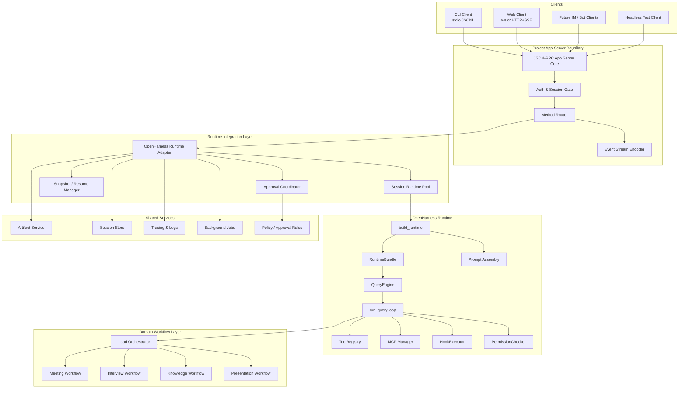
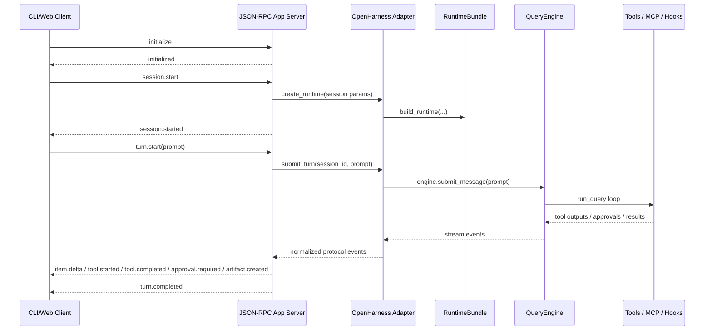

# Overall Architecture

## Goal

Create a Codex-style app-server on top of OpenHarness so that:

- CLI can be the first delivery surface
- backend iteration is fast
- frontend can be added later without changing runtime semantics
- one runtime can support multiple domain workflows

## Architecture Principles

1. Protocol before UI
2. Runtime separated from product boundary
3. CLI and Web share the same semantics, only transport differs
4. Domain workflows are mounted behind one app-server
5. Approvals, artifacts, and session replay are first-class primitives

## Overall System Diagram



## Layer Responsibilities

### 1. Clients

#### CLI Client
- first-class development surface
- uses stdio JSONL transport
- supports interactive and headless modes
- best place for backend rapid iteration

#### Web Client
- second surface
- uses websocket or HTTP+SSE through a web gateway
- same protocol semantics as CLI

#### Headless Test Client
- runs scripted regression tasks
- validates protocol behavior and domain workflows

### 2. JSON-RPC App Server Core

Owns the client-facing protocol.

Responsibilities:
- transport management
- `initialize` handshake
- session and turn lifecycle methods
- event fan-out
- stable error codes
- versioning and compatibility

The app-server must not leak OpenHarness internal message types directly.

### 3. OpenHarness Runtime Adapter

This is the key project-owned bridge.

Responsibilities:
- create and hold `RuntimeBundle` instances
- map `session.start` to `build_runtime()`
- map `turn.start` to `engine.submit_message()`
- map `turn.continue` to `engine.continue_pending()`
- convert runtime events into protocol events
- persist session snapshots
- coordinate approvals and artifacts

### 4. OpenHarness Runtime

Provides the local agent loop and agent shell mechanics.

Used parts:
- `build_runtime()`
- `RuntimeBundle`
- `QueryEngine`
- `run_query()`
- tools / hooks / permissions / MCP / prompts / session backend

### 5. Domain Workflow Layer

This is the business logic layer.

Contains:
- lead orchestrator
- meeting assistant workflow
- interview assistant workflow
- knowledge assistant workflow
- presentation workflow

This layer should be project-owned, not embedded inside protocol or raw runtime code.

### 6. Shared Services

#### Artifact Service
- store summaries, reports, scorecards, decks, intermediate outputs
- assign artifact ids
- support listing and reading

#### Session Store
- session metadata
- thread-to-runtime mapping
- snapshots for resume

#### Tracing & Logs
- request trace id
- session id
- turn id
- tool call id

#### Background Jobs
- future long-running deck generation
- future media / render tasks

#### Policy / Approval Rules
- approval-required tool classes
- denial rules
- reviewer mapping

## Core Protocol Model

The project protocol should use these top-level primitives.

### Thread
Long-lived conversation container.

### Turn
One user action plus one agent run.

### Item
Event or side effect inside a turn.
Examples:
- user message
- assistant delta
- tool start
- tool result
- approval request
- artifact creation

## Recommended Method Surface

### Required in v1

- `initialize`
- `session.start`
- `session.resume`
- `session.close`
- `turn.start`
- `turn.continue`
- `turn.interrupt`
- `approval.respond`
- `artifact.list`
- `artifact.read`
- `health.ping`

### Events in v1

- `session.started`
- `turn.started`
- `item.delta`
- `tool.started`
- `tool.completed`
- `approval.required`
- `artifact.created`
- `turn.completed`
- `turn.failed`
- `session.closed`

## End-to-End Request Flow



## Repository Shape

```text
repo/
  protocol/
    schema/
    methods/
    events/
  app_server/
    core/
    transports/
    routers/
  adapters/
    openharness/
  clients/
    cli/
    headless/
  gateway/
    web/
  domain/
    orchestrator/
    meeting/
    interview/
    knowledge/
    presentation/
  services/
    artifacts/
    sessions/
    approvals/
    tracing/
    jobs/
```

## Design Decisions to Freeze Early

1. Protocol schemas are project-owned
2. OpenHarness internals are hidden behind an adapter
3. CLI is the canonical first client
4. Web is just another client over the same protocol
5. Artifacts and approvals are stable first-class entities
6. Domain workflows live outside the raw runtime integration
