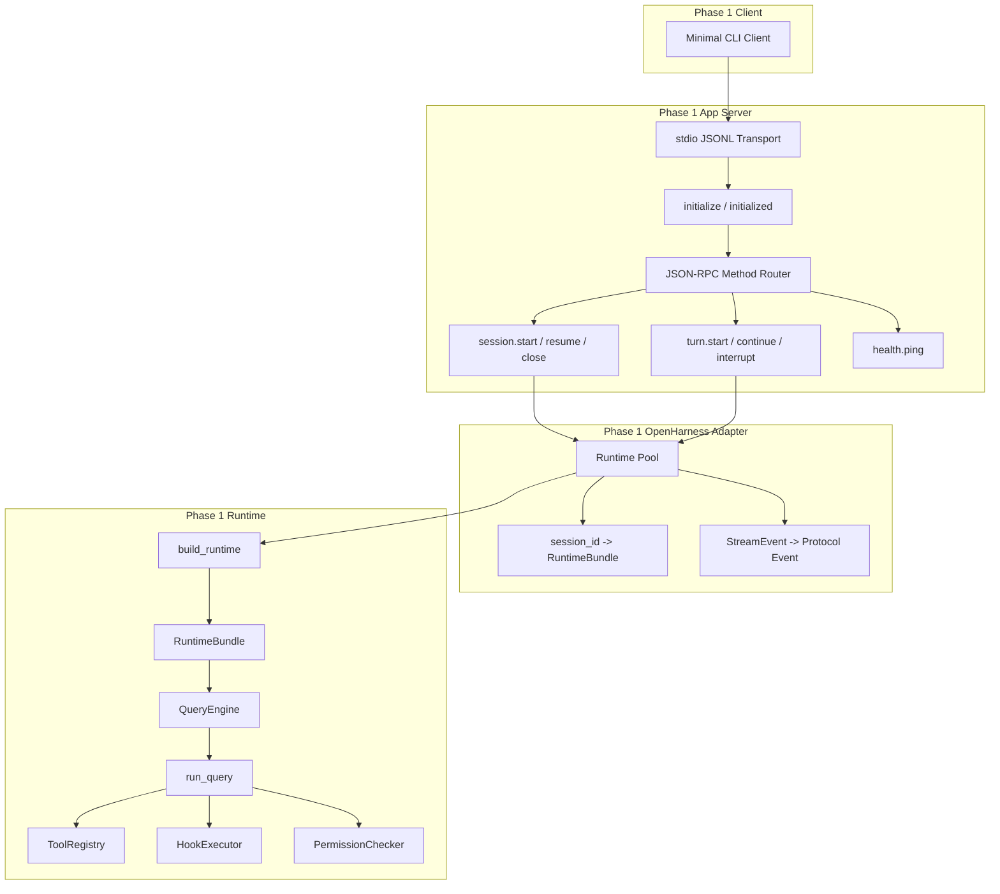
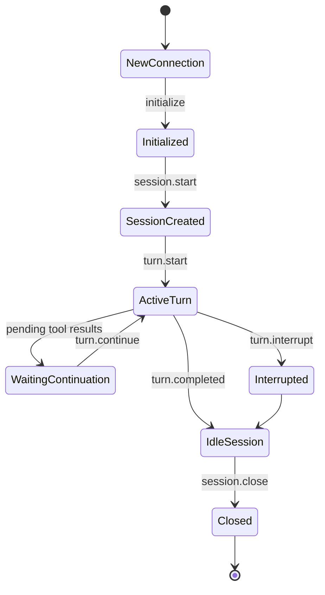

# Phase 1 Detailed Architecture

## Phase 1 Goal

Build the protocol layer and OpenHarness adapter so that one client can:

- initialize a connection
- create a session
- send one turn
- receive normalized streaming events
- close the session

This phase is about **core control-plane correctness**, not product polish.

## Scope

Included:
- JSON-RPC method router
- stdio transport
- session runtime pool
- OpenHarness runtime adapter
- basic event normalization
- health checks

Excluded:
- Web
- approvals UI
- artifact persistence beyond in-memory or local-dev store
- domain-specific workflows beyond a simple orchestrator prompt

## Phase 1 Architecture Diagram



## Responsibilities by Module

### `protocol/schema`
Defines JSON-RPC method payloads and event payloads.

Key files:
- `thread.ts` or `thread.py`
- `turn.ts` or `turn.py`
- `item.ts` or `item.py`
- `errors.ts` or `errors.py`

### `app_server/transports/stdio`
Responsibilities:
- line-delimited JSON read/write
- request id tracking
- handshake gating
- graceful shutdown

### `app_server/routers`
Responsibilities:
- validate request payloads
- dispatch to service layer
- enforce method availability by phase

### `adapters/openharness/runtime_adapter`
Responsibilities:
- call `build_runtime()`
- start and close runtime bundles
- submit prompts into `QueryEngine`
- translate events into protocol envelopes

### `services/sessions`
Responsibilities:
- create session ids
- runtime lookup
- in-memory session metadata

## Phase 1 Required Methods

```text
initialize
session.start
session.resume
session.close
turn.start
turn.continue
turn.interrupt
health.ping
```

## Phase 1 Event Model

```text
session.started
turn.started
item.delta
tool.started
tool.completed
turn.completed
turn.failed
session.closed
```

## Event Mapping Rules

### OpenHarness -> Protocol

- `AssistantTextDelta` -> `item.delta`
- `AssistantTurnComplete` -> `turn.completed`
- `ToolExecutionStarted` -> `tool.started`
- `ToolExecutionCompleted` -> `tool.completed`
- `StatusEvent` -> `item.status`
- `ErrorEvent` -> `turn.failed`

### Mapping principle

The adapter should **flatten and normalize**, not preserve raw runtime class names.

## Session Lifecycle



## Minimal Internal Contracts

### `RuntimeSession`

```ts
interface RuntimeSession {
  sessionId: string
  runtimeBundle: unknown
  createdAt: string
  lastActiveAt: string
  state: "idle" | "running" | "interrupted" | "closed"
}
```

### `TurnExecutionHandle`

```ts
interface TurnExecutionHandle {
  turnId: string
  sessionId: string
  startedAt: string
  status: "running" | "completed" | "failed" | "interrupted"
}
```

## Phase 1 Non-Functional Constraints

- one process is acceptable
- in-memory session store is acceptable
- local filesystem snapshots are acceptable
- only stdio transport is required
- no browser support yet

## Phase 1 Acceptance Criteria

1. `initialize` required before all other methods
2. `session.start` creates one runtime bundle
3. `turn.start` streams deltas and tool events
4. `session.resume` works within the same local session store
5. `turn.interrupt` ends an active turn cleanly
6. no OpenHarness internal Python class names leak into client payloads
7. protocol golden tests cover the happy path

## Phase 1 Recommended Sequence

1. Freeze schemas
2. Implement stdio transport
3. Implement handshake
4. Implement runtime adapter
5. Implement session store
6. Implement event mapping
7. Add headless regression client
