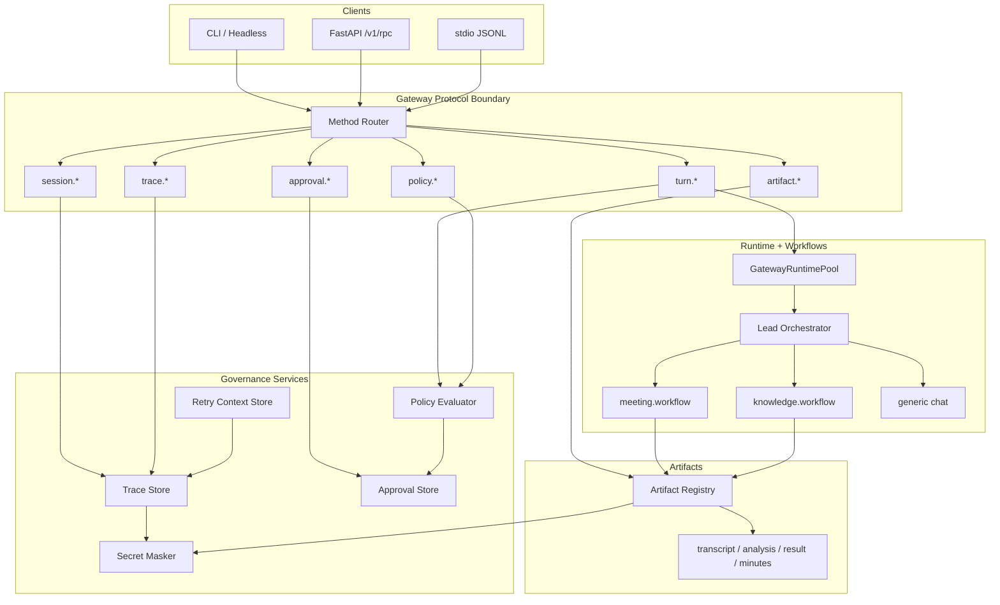

# Phase 2 Detailed Architecture

## Phase 2 Goal

Move harnessOS from "usable workflow orchestration" to "governed workflow execution".

Phase 0/1 already provide CLI/headless, Gateway RPC, stdio JSONL, session/turn events, meeting MCP integration, artifact registration, and Lead Orchestrator + DomainWorkflow Registry. Phase 2 adds the control primitives needed before broader productization:

- Trace/Audit
- Approval Coordinator
- Policy Rules
- Retry/Resume
- Secret Hygiene

Full background Job Service and multi-agent expansion are deferred to Phase 3. Phase 2 only reserves the fields those later services need.

## Phase 2 Gates

| Gate | Purpose | Deliverables |
| --- | --- | --- |
| 2-A Trace/Audit MVP | Make every important operation queryable | Done: trace store, `trace.list/get`, trace ids on session/turn/workflow/artifact events |
| 2-B Approval Coordinator MVP | Add human decision points | Done: `approval.request/list/get/approve/reject`, approval state persistence |
| 2-C Policy Rules MVP | Route risky operations through approval | Done: policy evaluator, `policy.evaluate`, turn preflight approval gate |
| 2-D Retry/Resume MVP | Recover policy-blocked operations | Done: `turn.retry`, saved retry context, approved-action continuation, duplicate retry prevention |
| 2-E Secret Hygiene | Avoid leaking secrets into persisted data | Done: secret masker, trace/log/approval/retry/artifact masking tests |
| 2-F Architecture Hardening | Reduce local persistence race risk | Done: file locks, atomic writes, concurrent persistence tests |

## Architecture Diagram



## New Gateway Methods

Trace:

```text
trace.list
trace.get
```

Approval:

```text
approval.request
approval.list
approval.get
approval.approve
approval.reject
```

Policy:

```text
policy.evaluate
```

Retry:

```text
turn.retry
```

`workflow.retry` remains optional for the first implementation. If `turn.retry` can retry a failed workflow turn with preserved context, that is sufficient for Phase 2-D.

## Data Models

### Trace Record

Required fields:

- `trace_id`
- `session_id`
- `turn_id`
- `event_type`
- `workflow_id`
- `artifact_ids`
- `approval_ids`
- `status`
- `input_summary`
- `created_at`
- `metadata`

### Approval Record

Required fields:

- `approval_id`
- `trace_id`
- `session_id`
- `turn_id`
- `risk_level`
- `action`
- `status`: `pending | approved | rejected | expired`
- `request_summary`
- `decision_reason`
- `created_at`
- `decided_at`

### Retry Context

Required fields:

- `retry_id`
- `source_turn_id`
- `session_id`
- `workflow_id`
- `input`
- `failure_message`
- `artifact_ids`
- `trace_id`
- `created_at`

## Policy Defaults

| Operation | Default |
| --- | --- |
| Read/list/search | Allow |
| Meeting transcription/analysis | Allow, trace required |
| Artifact read | Allow, trace required |
| Workspace write/delete | Approval required; Phase 2-C turn preflight blocks execution and creates pending approval |
| External send/publish | Approval required; Phase 2-C turn preflight blocks execution and creates pending approval |
| Shell/network/destructive actions | Approval required |

## Acceptance Criteria

1. Chat, meeting workflow, and artifact reads produce trace records. Done for MVP.
2. `trace.list/get` work through Gateway service and stdio JSONL. Done for MVP.
3. `approval.request/list/get/approve/reject` work through Gateway service and stdio JSONL. Done for MVP.
4. Write/send/publish operations default to pending approval. Done for Phase 2-C turn preflight.
5. Rejected/pending approval blocks execution. Approved approval permits continuation through `turn.retry`. Done for policy-blocked turns.
6. Simulated failed turn can be retried without corrupting session events or duplicating failed artifacts.
7. Meeting real-audio acceptance still passes using `/Users/Zhuanz/Desktop/workspace/音频资料`.
8. Secrets such as `sk-*`, `Authorization: Bearer ...`, and token-like values are masked before trace/log/approval/retry/artifact persistence. Done for common patterns.

## Phase 2-A Completion Notes

Implemented:

- `apps/gateway/traces.py`
- `trace.list`
- `trace.get`
- `trace_id` returned by `turn.start`
- trace records for turn events, runtime tool events, artifact operations, and meeting workflow artifact linkage

Verified:

- `tests/test_trace_gateway.py`
- `tests/test_gateway_protocol.py::test_turn_start_records_trace`
- stdio `trace.get`

Known limitation:

- Event metadata is intentionally preserved for audit usefulness, so Phase 2-E must add masking before trace data is considered production-safe.

## Phase 2-B Completion Notes

Implemented:

- `apps/gateway/approvals.py`
- `approval.request`
- `approval.list`
- `approval.get`
- `approval.approve`
- `approval.reject`
- approval lifecycle trace records

Verified:

- `tests/test_approval_gateway.py`
- stdio `approval.request`
- manual `approval.approve` followed by `trace.get`

Known limitation:

- Approval records are lifecycle objects only. Phase 2-C adds policy gates that automatically create approvals for risky operations.
- Approved requests now resume through `turn.retry` for policy-blocked turns. Generic workflow retry remains future hardening.

## Phase 2-C Completion Notes

Implemented:

- `apps/gateway/policies.py`
- `PolicyEvaluator.evaluate_user_input`
- `PolicyEvaluator.evaluate_tool`
- `policy.evaluate`
- `turn.start` preflight gate for write/delete/send/publish intents
- approval + trace linkage for policy-gated turns

Verified:

- `tests/test_policy_approval.py`
- `tests/test_approval_gateway.py`
- `tests/test_trace_gateway.py`
- Full related regression: 45 passed across policy, approval, trace, gateway protocol, stdio, meeting workflow, CLI headless, and lead orchestrator tests
- Manual CLI write-like smoke: `approval_id=appr_1532cf6d65fc`, `trace_id=trace_030c83793b25`, target file not created

Known limitation:

- The current enforcement point is Gateway turn preflight and deterministic tool classification. A later tool-execution middleware should wrap OpenHarness ToolRegistry for defense in depth.
- Approved actions continue through `turn.retry`; automatic UI-side continuation remains a client workflow concern.

## Phase 2-D Completion Notes

Implemented:

- `apps/gateway/retries.py`
- `RetryStore.create_policy_context`
- `RetryStore.get_by_turn`
- `RetryStore.get_by_approval`
- `RetryStore.mark_retried`
- `turn.retry`
- `GatewayRuntimePool.run_turn(..., skip_policy=True, retry_of_turn_id=..., approval_id=...)`
- policy-blocked turn context capture

Verified:

- `tests/test_retry_resume.py`
- Phase 2-D/2-C/2-B/2-A combined tests: 12 passed
- Full related regression: 47 passed across retry, policy, approval, trace, gateway protocol, stdio, meeting workflow, CLI headless, and lead orchestrator tests

Known limitation:

- Phase 2-D currently covers policy-blocked turn continuation. Generic failed workflow retry and ToolRegistry-level idempotency are future hardening items.

## Phase 2-E Completion Notes

Implemented:

- `apps/gateway/secrets.py`
- `mask_text`
- `mask_value`
- session event log masking
- trace metadata and summary masking
- approval request/decision masking
- retry context masking
- artifact metadata and `artifact.read` response masking

Verified:

- `tests/test_secret_hygiene.py`
- Phase 2-E/2-D/2-C/2-B/2-A combined tests: 15 passed
- Full related regression: 50 passed across secret hygiene, retry, policy, approval, trace, gateway protocol, stdio, meeting workflow, CLI headless, and lead orchestrator tests

Known limitation:

- This is regex-based masking, not full DLP.
- External source artifact files are not rewritten in place; Gateway metadata and read responses are masked.

## Phase 2-F Completion Notes

Implemented:

- `apps/gateway/persistence.py`
- locked JSON list read-modify-write
- locked JSONL append/read
- atomic snapshot/index replacement
- ApprovalStore, RetryStore, ArtifactRegistry, TraceStore, and GatewaySessionStore persistence hardening

Verified:

- `tests/test_gateway_persistence.py`
- Phase 2-F/2-E/2-D/2-C/2-B/2-A combined tests: 19 passed
- Full related regression: 54 passed across persistence, secret hygiene, retry, policy, approval, trace, gateway protocol, stdio, meeting workflow, CLI headless, and lead orchestrator tests

Known limitation:

- Local file locks are appropriate for single-machine development and light local use. Multi-worker API deployment still needs an external database or a coordinated runtime/session store.

## Test Plan

| Test | Command |
| --- | --- |
| Trace gateway | `pytest tests/test_trace_gateway.py` |
| Approval gateway | `pytest tests/test_approval_gateway.py` |
| Policy approval | `pytest tests/test_policy_approval.py` |
| Retry/resume | `pytest tests/test_retry_resume.py` |
| Secret hygiene | `pytest tests/test_secret_hygiene.py` |
| Meeting regression | `pytest tests/test_meeting_gateway.py tests/test_meeting_turn_workflow.py tests/test_meeting_audio_acceptance.py` |
| Protocol parity | `pytest tests/test_gateway_protocol.py tests/test_gateway_stdio.py tests/test_rpc_stdio_compat.py` |

## Manual Acceptance

1. Run `python3 -m cli.main run --json '你好'`, then query trace by returned session/turn.
2. Run the real meeting audio command against `/Users/Zhuanz/Desktop/workspace/音频资料`, then confirm trace links `meeting.workflow` and meeting artifacts.
3. Request a workspace write and confirm it becomes pending approval.
4. Reject approval and confirm the file is not written.
5. Approve approval and call `turn.retry`; confirm retry events include `retry_of_turn_id` and `approval_id`.
6. Submit text containing `sk-test-1234567890`; confirm persisted trace/log/artifact data is masked.
