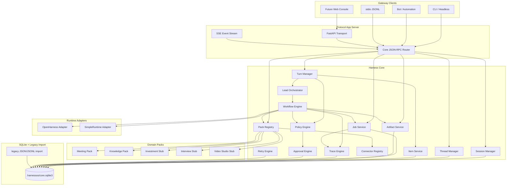

# Phase 3 / Core v1.5 Detailed Architecture

## Goal

Phase 3 is redefined as **Core v1.5**: convert harnessOS from a working Gateway + Meeting workflow into a local-first Agent OS / App Server Core.

The target shape is:

- **Harness Core** owns protocol objects, stores, governance, jobs, artifacts, trace, approvals, retry, policy, workflow routing, and runtime adapters.
- **Protocol App Server** exposes Core through JSON-RPC, SSE, stdio JSONL, CLI, and future Web/Bot clients.
- **Domain Packs** provide business capabilities. Core must not hard-code meeting, investment, interview, or video logic.
- **Runtime Adapters** wrap OpenHarness and SimpleRuntime behind a stable Core interface.

Confirmed implementation choices:

- Core-first big refactor.
- Old Gateway method names and response shapes may break.
- SQLite is the default next Store.
- Legacy `.harnessos` JSON/JSONL data must remain importable/readable during migration.
- `Session / Thread / Turn / Item` become the first-class protocol model.
- Meeting and Knowledge become real packs.
- Investment, Interview, and Video Studio start as manifest stubs.

## Target Architecture



## Core Objects

Core v1.5 introduces these first-class objects:

| Object | Purpose |
| --- | --- |
| Session | Client/user runtime context |
| Thread | Project/task context across turns |
| Turn | One user input and execution lifecycle |
| Item | Message, status, tool call, approval, artifact link, log, or event inside a turn |
| Job | Long-running workflow execution |
| Artifact | Output file/object with lineage and metadata |
| Approval | Human decision record for risky actions |
| Connector | MCP/tool/external system capability descriptor |

Minimum Core-native RPC surface:

```text
core.initialize
core.health
session.create / session.get / session.list / session.close
thread.create / thread.get / thread.list
turn.start / turn.get / turn.items / turn.interrupt / turn.retry
artifact.register / artifact.get / artifact.list / artifact.read
trace.get / trace.list
approval.request / approval.approve / approval.reject / approval.list
job.create / job.get / job.list / job.cancel / job.events
pack.list / pack.get
workflow.list
connector.list
policy.evaluate
```

## Domain Pack Model

A pack is the business migration unit. Pack structure:

```text
packs/<domain>/
  manifest.yaml
  workflows/
  subagents/
  skills/
  connectors/
  policies/
  artifact_types/
  prompts/
  examples/
```

First implementation targets:

| Pack | Stage | Behavior |
| --- | --- | --- |
| meeting | Real | Existing Meeting MCP workflow, real audio acceptance |
| knowledge | Real | Existing knowledge search/ingest workflow |
| investment | Stub | Manifest, risk profile, future workflow names |
| interview | Stub | Manifest and future workflow names |
| video_studio | Stub | Manifest and future roles: director/script/editor/QA |

Meeting Pack remains the end-to-end acceptance scenario and must use audio under `/Users/Zhuanz/Desktop/workspace/音频资料`.

## Store Strategy

SQLite becomes the default next Store:

```text
.harnessos/core.sqlite3
```

Required stores:

- SessionStore
- ThreadStore
- ItemStore
- ArtifactStore
- TraceStore
- ApprovalStore
- RetryStore
- JobStore
- PackRegistryStore

Migration behavior:

- New writes go to SQLite.
- Legacy `.harnessos/sessions`, `traces`, `artifacts`, `approvals`, and `retries` remain readable/importable.
- Legacy files are not deleted.

## Implementation Order

1. Define Core protocol models and RPC method names.
2. Build SQLite schema and Store interfaces.
3. Migrate current file stores behind the new Store interfaces.
4. Split current `GatewayService` into Core service + transport adapters.
5. Split `GatewayRuntimePool` into session/turn/runtime/workflow responsibilities.
6. Add Pack Registry and manifest loader.
7. Migrate meeting/knowledge to packs.
8. Add investment/interview/video_studio manifest stubs.
9. Add Job Service MVP and move real meeting audio analysis through jobs.
10. Add Tool Policy Middleware below turn preflight.
11. Update docs, tests, manual acceptance, and drawio after every stage.

## Acceptance Criteria

- `你好` creates session/thread/turn/items and can be queried through Core RPC.
- Meeting audio analysis routes through Meeting Pack and creates a job.
- Meeting job completes with transcript/minutes/analysis/result artifacts.
- SQLite contains session/thread/turn/item/job/artifact/trace records.
- `pack.list` shows meeting, knowledge, investment, interview, and video_studio.
- Existing meeting and knowledge behavior does not regress after migration.
- Risky tool execution is blocked by Tool Policy Middleware until approval.
- Documentation and current-vs-target diagrams are updated after the stage.

## Current Non-Goals

- No real investment advice generation in this stage.
- No real interview workflow implementation in this stage.
- No real video generation or multi-agent editing pipeline in this stage.
- No Postgres dependency.
- No full Web UI productization.
