# harnessOS 总体架构与核心接口数据模型说明（v1.0）

## 1. 文档定位

本文档用于把当前对 harnessOS 的目标架构分析、模块拆分、核心接口与数据模型整合成一份可执行的工程说明，供 Claude Code、开发团队和后续协作者直接使用。

当前项目不再只是一个会议助手或 CLI agent，而是要演化为：

- 一个 **protocol-first** 的 Agent Harness Core
- 一个 **OS-like Agent App Server**
- 一个可承载多个业务域的 **Domain Pack Platform**

目标业务域包括：

- 会议助手
- 知识库助手
- 投资建议 / 仓位管理 / 策略回测
- 应聘助手 / 面试流程管理 / 技能学习
- AI 视频工作流 / 多 Agent 工位协作 / 产出物管理

---

## 2. 项目定位

### 2.1 技术定位

harnessOS 本质上仍属于 **Harness / App Server** 范畴，而不是底层操作系统内核。它提供的是包在 LLM 外部的基础设施：

- tools
- skills
- memory
- permissions
- governance
- workflow orchestration
- artifact persistence
- background jobs

### 2.2 产品定位

harnessOS 不是单一业务助手，而是一个：

> **协议优先、可治理、可扩展、可迁移的 Agent Harness Core，正演化为面向 Agent 工作负载的 OS-like App Server。**

---

## 3. 核心设计原则

### 原则 1：协议优先

所有客户端都必须经过统一协议层进入系统：

- CLI
- Web
- Admin Console
- Bot
- Automation / API consumers

客户端只换 transport，不换语义。

### 原则 2：Core 不带业务

Core 只承载：

- 协议
- 编排
- 治理
- 运行时适配
- 作业系统
- 存储抽象
- 产出物系统

业务能力必须通过 Domain Pack 接入。

### 原则 3：Runtime 可替换

当前以 OpenHarness 作为主要执行内核，但业务层不得直接依赖 OpenHarness 内部 message / engine 类型。需要通过 Runtime Adapter 收敛。

### 原则 4：治理深入执行层

治理必须同时覆盖：

- turn preflight
- tool invocation
- job execution
- artifact persistence
- retry / resume

### 原则 5：一切重要状态可追踪

以下对象必须可查询、可恢复、可审计：

- Session
- Thread
- Turn
- Item
- Approval
- Job
- Artifact
- Trace

---

## 4. 总体目标架构

```mermaid
flowchart TB
    subgraph Clients["Client / Gateway Plane"]
        CLI["CLI / Headless"]
        WEB["Web / Admin Console"]
        BOT["Bot / Automation / API Consumers"]
    end

    subgraph Protocol["Protocol App Server Plane"]
        RPC["JSON-RPC App Server"]
        SSE["SSE / Event Streaming"]
        STDIO["stdio JSONL"]
        WG["Web Gateway / WS Proxy"]
    end

    subgraph Core["Harness Core Plane"]
        SM["Session Manager"]
        TTM["Thread / Turn Manager"]
        IEM["Item / Event Model"]
        ORCH["Lead Orchestrator"]
        ROUTER["Intent Router"]
        WF["Workflow Engine"]
        AGENTREG["SubAgent Registry"]
        TOOLREG["Tool Registry"]
        SKILLREG["Skill Registry"]
        CONNREG["Connector Registry"]
        POLICY["Policy Engine"]
        APPROVAL["Approval Engine"]
        RETRY["Retry / Resume Engine"]
        TRACE["Trace / Audit Engine"]
        SECRET["Secret Hygiene"]
        JOB["Job Service"]
        ART["Artifact Service"]
    end

    subgraph Runtime["Runtime Adapter Plane"]
        OHR["OpenHarness Runtime Adapter"]
        SIMP["SimpleRuntime Adapter"]
        DPA["DeepAgents Adapter (future)"]
    end

    subgraph Packs["Domain Pack Plane"]
        MEET["Meeting Pack"]
        KNOW["Knowledge Pack"]
        INVEST["Investment Pack"]
        INTERVIEW["Interview Pack"]
        VIDEO["AI Video Studio Pack"]
    end

    subgraph Connectors["Connector / Tool / Store Plane"]
        MCP["Local MCP Servers"]
        TOOLS["Native Tools"]
        FS["Workspace / File Tools"]
        BROWSER["Browser / Web Tools"]
        DATASRC["Data Sources / External APIs"]
        SSTORE["SessionStore"]
        TSTORE["TraceStore"]
        ASTORE["ArtifactStore"]
        APSTORE["ApprovalStore"]
        JSTORE["JobStore"]
        KSTORE["KnowledgeStore"]
        MEMSTORE["MemoryStore"]
        CFG["Config / Skill / Plugin Store"]
    end

    CLI --> RPC
    CLI --> STDIO
    WEB --> WG
    WEB --> SSE
    BOT --> RPC

    WG --> RPC
    SSE --> RPC
    STDIO --> RPC

    RPC --> SM
    RPC --> TTM
    RPC --> IEM
    RPC --> ORCH

    ORCH --> ROUTER
    ROUTER --> WF
    WF --> AGENTREG
    WF --> TOOLREG
    WF --> SKILLREG
    WF --> CONNREG
    WF --> JOB
    WF --> ART

    TOOLREG --> POLICY
    TOOLREG --> APPROVAL
    TOOLREG --> SECRET
    WF --> RETRY
    WF --> TRACE

    ORCH --> OHR
    ORCH --> SIMP
    ORCH --> DPA

    OHR --> MEET
    OHR --> KNOW
    OHR --> INVEST
    OHR --> INTERVIEW
    OHR --> VIDEO

    CONNREG --> MCP
    CONNREG --> TOOLS
    CONNREG --> FS
    CONNREG --> BROWSER
    CONNREG --> DATASRC

    SM --> SSTORE
    TRACE --> TSTORE
    ART --> ASTORE
    APPROVAL --> APSTORE
    JOB --> JSTORE
    KNOW --> KSTORE
    ORCH --> MEMSTORE
    SKILLREG --> CFG
```



---

## 5. 分层职责说明

### 5.1 Client / Gateway Plane

承载所有用户和系统入口：

- CLI：开发调试、自动化脚本、回归测试
- Web：产品 UI、管理界面
- Admin Console：审批、trace、connector 健康检查
- Bot / Automation：飞书、Slack、Telegram、外部系统调用

### 5.2 Protocol App Server Plane

提供统一协议边界：

- JSON-RPC
- SSE
- stdio JSONL
- Web Gateway / WS Proxy

这一层只做协议封装与事件流分发，不直接做业务逻辑。

### 5.3 Harness Core Plane

系统长期稳定核心，负责：

- Session / Thread / Turn 生命周期
- 编排与路由
- workflow / subagent / tool / skill / connector 注册
- policy / approval / retry / trace / secret hygiene
- jobs / artifacts

### 5.4 Runtime Adapter Plane

隔离底层执行内核：

- 当前主实现：OpenHarnessRuntimeAdapter
- 测试/兜底：SimpleRuntimeAdapter
- 未来可选：DeepAgentsRuntimeAdapter

### 5.5 Domain Pack Plane

所有业务能力以 Pack 挂载：

- Meeting Pack
- Knowledge Pack
- Investment Pack
- Interview Pack
- Video Studio Pack

### 5.6 Connector / Tool / Store Plane

统一管理：

- MCP servers
- native tools
- filesystem / browser / shell tools
- 外部 API / 数据源
- local-file：开发模式
- sqlite：本地生产候选
- postgres：正式生产候选

当前相邻项目 MCP 边界：

- Meeting / ASR 使用 `funasr_mcp` 连接 `/Users/Zhuanz/Desktop/workspace/voice_service/funasr_service`，底层通过 FunASR 服务完成语音转写。
- Knowledge 使用 `data_service_mcp` 连接 `/Users/Zhuanz/Desktop/workspace/meeting-voice-assistant/backend/data_service`，按照 `/Users/Zhuanz/Desktop/workspace/meeting-voice-assistant/docs/data_service/MCP-EXTERNAL-AGENT-GUIDE.md` 完成 GraphRAG + llmwiki 知识库生命周期。
- Pack、Core 和 Gateway 不直接写相邻项目的 GraphRAG、llmwiki、quality 或 FunASR 模型产物目录；所有跨项目调用必须通过 connector registry + MCP tool contract。

---

## 6. 模块拆分表

### 6.1 应用入口层

| 模块 | 路径 | 职责 | 备注 |
|---|---|---|---|
| Protocol API | `apps/api` | 对外提供 JSON-RPC / SSE / REST 辅助接口 | 必须去模块级单例 |
| Web Gateway | `apps/web_gateway` | 面向 Web 的 transport 适配与 streaming 转发 | 不承载业务逻辑 |
| CLI Client | `apps/cli` | stdio JSONL / 本地 RPC 客户端 | 第一调试入口 |
| Admin Console | `apps/admin_console` | trace / approval / jobs / connectors 管理界面 | 可后置开发 |

### 6.2 Core 平台层

| 模块 | 路径 | 职责 |
|---|---|---|
| Protocol Schema | `core/protocol` | 统一 schema / methods / events / errors |
| Session Manager | `core/session` | session 创建 / 恢复 / 关闭 |
| ThreadTurn Manager | `core/thread_turn` | thread / turn 生命周期管理 |
| ItemEvent Model | `core/item_event` | 统一 Item / Event 模型 |
| Lead Orchestrator | `core/orchestrator` | 全系统统一编排入口 |
| Intent Router | `core/router` | 路由到 workflow / subagent / domain |
| Workflow Engine | `core/workflows` | workflow 注册、执行、重试、与 job/artifact 绑定 |
| SubAgent Registry | `core/subagents` | 管理 specialist agents |
| Tool Registry | `core/tools` | tool 注册、执行包装、策略拦截 |
| Skill Registry | `core/skills` | skill manifest、加载、版本管理 |
| Connector Registry | `core/connectors` | connector 注册、健康检查、能力发现 |
| Policy Engine | `core/policy` | turn/tool/job 风险判定 |
| Approval Engine | `core/approval` | 审批请求、审批状态机 |
| Retry Engine | `core/retry` | retry / resume / idempotency |
| Trace Engine | `core/trace` | 全链路 trace / audit |
| Secret Hygiene | `core/secrets` | 敏感信息 scrub |
| Job Service | `core/jobs` | 长任务 create/get/list/cancel |
| Artifact Service | `core/artifacts` | artifact 注册、查询、读取、谱系 |

### 6.3 Runtime Adapter 层

| 模块 | 路径 | 职责 |
|---|---|---|
| OpenHarness Adapter | `runtime_adapters/openharness` | 当前主要执行后端 |
| Simple Adapter | `runtime_adapters/simple` | fallback / 测试运行时 |
| DeepAgents Future | `runtime_adapters/deepagents_future` | 未来复杂 graph/runtime 预留 |

### 6.4 Domain Pack 层

| Pack | 路径 | 核心能力 |
|---|---|---|
| Meeting | `packs/meeting` | transcript / analysis / minutes / followup |
| Knowledge | `packs/knowledge` | ingest / search / summarize / citation |
| Investment | `packs/investment` | portfolio / advice / position / backtest |
| Interview | `packs/interview` | interview flow / skill learn / progress review |
| Video Studio | `packs/video_studio` | brief / script / storyboard / role assignment / edit pipeline |

### 6.5 Store 层

| 模块 | 路径 | 职责 |
|---|---|---|
| Local File Store | `stores/local_file` | 开发环境存储 |
| SQLite Store | `stores/sqlite` | 本地生产候选 |
| Postgres Future | `stores/postgres_future` | 正式生产预留 |

---

## 7. 目录建议

```text
harnessos/
  apps/
    api/
    web_gateway/
    cli/
    admin_console/
  core/
    protocol/
    session/
    thread_turn/
    item_event/
    orchestrator/
    router/
    workflows/
    subagents/
    tools/
    skills/
    connectors/
    policy/
    approval/
    retry/
    trace/
    secrets/
    jobs/
    artifacts/
  runtime_adapters/
    openharness/
    simple/
    deepagents_future/
  packs/
    meeting/
    knowledge/
    investment/
    interview/
    video_studio/
  stores/
    local_file/
    sqlite/
    postgres_future/
  infra/
    config/
    auth/
    metrics/
    logging/
    testing/
```

---

## 8. 核心接口说明

## 8.1 Protocol 核心方法

### `initialize`
建立客户端与 app-server 的协议会话。

**请求**
```json
{
  "method": "initialize",
  "id": 1,
  "params": {
    "clientInfo": {
      "name": "my_cli",
      "version": "0.1.0"
    },
    "capabilities": {
      "supportsStreaming": true,
      "transport": "stdio"
    }
  }
}
```

**响应**
```json
{
  "id": 1,
  "result": {
    "serverInfo": {
      "name": "harnessos",
      "version": "0.1.0"
    },
    "protocolVersion": "v1"
  }
}
```

### `session.start`
创建 session。

### `thread.start`
创建 thread。

### `turn.start`
开始一轮执行。

### `turn.continue`
继续等待 approval 或 tool results 后的 turn。

### `turn.interrupt`
中断 turn。

### `approval.respond`
对审批做 approve/reject。

### `artifact.list` / `artifact.read`
列出和读取 artifacts。

### `job.create` / `job.get` / `job.list` / `job.cancel`
管理后台任务。

---

## 8.2 Runtime Adapter 接口

```python
from typing import Protocol, AsyncIterator, Any

class RuntimeAdapter(Protocol):
    async def start_session(self, session_ctx: dict[str, Any]) -> dict[str, Any]:
        ...

    async def resume_session(self, session_id: str) -> dict[str, Any]:
        ...

    async def close_session(self, session_id: str) -> None:
        ...

    async def start_turn(self, turn_request: dict[str, Any]) -> AsyncIterator[dict[str, Any]]:
        ...

    async def continue_turn(self, turn_id: str, payload: dict[str, Any]) -> AsyncIterator[dict[str, Any]]:
        ...

    async def interrupt_turn(self, turn_id: str) -> dict[str, Any]:
        ...
```

---

## 8.3 Workflow 接口

```python
from typing import Protocol, Any

class Workflow(Protocol):
    name: str
    domain: str
    mode: str  # sync | async

    async def validate(self, request: dict[str, Any]) -> None:
        ...

    async def run(self, request: dict[str, Any], context: dict[str, Any]) -> dict[str, Any]:
        ...
```

### WorkflowSpec

```python
from dataclasses import dataclass, field
from typing import Literal

@dataclass
class WorkflowSpec:
    name: str
    domain: str
    mode: Literal["sync", "async"]
    required_connectors: list[str] = field(default_factory=list)
    required_tools: list[str] = field(default_factory=list)
    required_skills: list[str] = field(default_factory=list)
    artifact_outputs: list[str] = field(default_factory=list)
    risk_profile: str = "normal"
```

---

## 8.4 SubAgent 接口

```python
from dataclasses import dataclass, field

@dataclass
class SubAgentSpec:
    name: str
    domain: str
    capabilities: list[str]
    tools: list[str] = field(default_factory=list)
    skills: list[str] = field(default_factory=list)
    prompt_ref: str | None = None
    risk_level: str = "normal"
    execution_mode: str = "sync"  # sync | async
    artifact_contract: list[str] = field(default_factory=list)
```

---

## 8.5 Connector 接口

```python
from dataclasses import dataclass, field

@dataclass
class ConnectorSpec:
    connector_id: str
    kind: str  # mcp | native_tool | local_service | external_api | data_source
    domain: str
    version: str
    capabilities: list[str] = field(default_factory=list)
    config_ref: str | None = None
    healthcheck_uri: str | None = None
```

---

## 8.6 Store 接口

```python
from typing import Protocol, Any

class SessionStore(Protocol):
    async def create(self, session: dict[str, Any]) -> None: ...
    async def get(self, session_id: str) -> dict[str, Any] | None: ...
    async def update(self, session_id: str, patch: dict[str, Any]) -> None: ...

class TraceStore(Protocol):
    async def append(self, trace_event: dict[str, Any]) -> None: ...
    async def list(self, query: dict[str, Any]) -> list[dict[str, Any]]: ...

class ArtifactStore(Protocol):
    async def create(self, artifact: dict[str, Any]) -> None: ...
    async def get(self, artifact_id: str) -> dict[str, Any] | None: ...
    async def list(self, query: dict[str, Any]) -> list[dict[str, Any]]: ...

class ApprovalStore(Protocol):
    async def create(self, approval: dict[str, Any]) -> None: ...
    async def get(self, approval_id: str) -> dict[str, Any] | None: ...
    async def decide(self, approval_id: str, decision: dict[str, Any]) -> None: ...

class JobStore(Protocol):
    async def create(self, job: dict[str, Any]) -> None: ...
    async def get(self, job_id: str) -> dict[str, Any] | None: ...
    async def list(self, query: dict[str, Any]) -> list[dict[str, Any]]: ...
    async def update(self, job_id: str, patch: dict[str, Any]) -> None: ...
```

---

## 9. 核心数据模型

## 9.1 Session

```json
{
  "session_id": "sess_001",
  "client_type": "cli",
  "user_id": "u_123",
  "tenant_id": "t_001",
  "capabilities": {
    "supports_streaming": true,
    "transport": "stdio"
  },
  "created_at": "2026-04-28T12:00:00Z"
}
```

## 9.2 Thread

```json
{
  "thread_id": "thr_001",
  "session_id": "sess_001",
  "domain": "meeting",
  "title": "Weekly sync analysis",
  "status": "active",
  "goal": "Generate meeting minutes and action items",
  "metadata": {}
}
```

## 9.3 Turn

```json
{
  "turn_id": "turn_001",
  "thread_id": "thr_001",
  "status": "running",
  "input": {
    "text": "Summarize the attached meeting audio",
    "artifact_ids": ["art_audio_001"]
  },
  "trace_id": "trace_001",
  "started_at": "2026-04-28T12:00:10Z",
  "completed_at": null
}
```

## 9.4 Item

```json
{
  "item_id": "item_001",
  "turn_id": "turn_001",
  "type": "tool_call",
  "name": "meeting.analyze_audio",
  "status": "completed",
  "payload": {
    "input_summary": "audio artifact art_audio_001",
    "output_artifact_ids": ["art_minutes_001"]
  },
  "created_at": "2026-04-28T12:00:12Z"
}
```

## 9.5 Job

```json
{
  "job_id": "job_001",
  "workflow_id": "meeting.workflow",
  "domain": "meeting",
  "session_id": "sess_001",
  "thread_id": "thr_001",
  "turn_id": "turn_001",
  "status": "running",
  "progress": 0.65,
  "trace_id": "trace_001",
  "artifact_ids": ["art_audio_001"],
  "failure_context": null
}
```

## 9.6 Artifact

```json
{
  "artifact_id": "art_minutes_001",
  "kind": "minutes",
  "domain": "meeting",
  "owner_session_id": "sess_001",
  "owner_thread_id": "thr_001",
  "owner_turn_id": "turn_001",
  "uri": "store://artifacts/art_minutes_001.md",
  "metadata": {
    "title": "Weekly Sync Minutes"
  },
  "parent_ids": ["art_audio_001"],
  "created_at": "2026-04-28T12:01:00Z"
}
```

## 9.7 Approval

```json
{
  "approval_id": "appr_001",
  "target_type": "tool_call",
  "target_id": "toolcall_001",
  "risk_class": "high",
  "reason": "external publish requested",
  "decision": null,
  "reviewer": null,
  "decided_at": null
}
```

## 9.8 Trace Event

```json
{
  "trace_id": "trace_001",
  "source_type": "turn",
  "source_id": "turn_001",
  "event_type": "tool.completed",
  "payload": {
    "tool": "meeting.generate_minutes",
    "artifact_ids": ["art_minutes_001"]
  },
  "created_at": "2026-04-28T12:01:00Z"
}
```

## 9.9 Skill Manifest

```json
{
  "name": "meeting-minutes",
  "domain": "meeting",
  "description": "Generate structured meeting minutes and action items",
  "triggers": ["minutes", "meeting summary", "action items"],
  "allowed_tools": ["meeting.analyze_audio", "artifact.save"],
  "artifact_templates": ["minutes"],
  "resources": []
}
```

## 9.10 Pack Manifest

```json
{
  "name": "meeting-pack",
  "version": "0.1.0",
  "domain": "meeting",
  "required_connectors": ["meeting_voice_mcp"],
  "exposed_workflows": ["meeting.workflow"],
  "exposed_subagents": ["meeting_analyst"],
  "artifact_kinds": ["transcript", "analysis", "minutes"],
  "risk_profile": "normal"
}
```

---

## 10. Pack 设计说明

### 10.1 Meeting Pack

**职责**
- 音频转写
- 会议分析
- 纪要生成
- follow-up 产出

**Artifacts**
- transcript
- analysis
- minutes

### 10.2 Knowledge Pack

**职责**
- ingest
- search
- summarize
- citation

**Artifacts**
- note
- brief
- citation bundle

### 10.3 Investment Pack

**职责**
- 资产分析
- 投资建议生成
- 仓位管理
- 策略回测

**治理要求**
- 高风险 approval
- 更严格 policy profile
- trace 强制打开

### 10.4 Interview Pack

**职责**
- 面试流程计划
- mock interview
- 技能学习
- 进度复盘

### 10.5 Video Studio Pack

**职责**
- brief
- script
- storyboard
- role assignment
- edit pipeline
- publish

**推荐 Agent Crew**
- Studio Lead
- Director Agent
- Script Agent
- Research Agent
- Storyboard Agent
- Editing Agent
- QA / Publish Agent

---

## 11. Phase 3 推荐落地顺序

### Phase 3A：Store abstraction 硬化

重点模块：
- `stores/*`
- `core/session`
- `core/thread_turn`
- `apps/api` 去单例化

### Phase 3B：ToolRegistry Policy Middleware

重点模块：
- `core/tools`
- `core/policy`
- `core/approval`
- `core/retry`

### Phase 3C：Job Service MVP

重点模块：
- `core/jobs`
- `core/artifacts`
- `TraceStore / JobStore / ArtifactStore`

### Phase 3D：SubAgent Registry + Intent Router

重点模块：
- `core/subagents`
- `core/router`
- `core/workflows`

### Phase 3E：Domain Pack System

重点模块：
- `packs/*`
- `core/connectors`
- `core/skills`

---

## 12. 实施约束

1. `apps/*` 禁止直接依赖 OpenHarness 内部对象。
2. Core 禁止直接写死 domain 业务逻辑。
3. Domain Pack 禁止回写 Core 内部实现。
4. Tool 执行必须经过 policy + approval + trace。
5. Job 输出必须统一登记为 artifact。
6. 所有重要对象必须可被 trace 查询。

---

## 13. 最小优先实现清单

如果只先做最关键的一批模块，优先级如下：

```text
apps/api
core/protocol
core/session
core/thread_turn
core/orchestrator
core/tools
core/policy
core/approval
core/jobs
core/artifacts
runtime_adapters/openharness
stores/sqlite
```

这批模块做稳后，系统才真正从“业务助手集合”进化为“平台 core”。

---

## 14. 最终结论

harnessOS 的目标架构不是“继续把某个助手做大”，而是：

> **以统一协议为边界，以 Harness Core 为平台中台，以 Runtime Adapter 为执行隔离层，以 Domain Pack 为业务扩展单元，最终承载会议、知识、投资、面试和 AI 视频等多类 Agent 工作负载。**

因此，当前项目的正式目标架构可以定义为：

> **Protocol-first Harness Core + OS-like Agent App Server + Domain Pack Platform**
