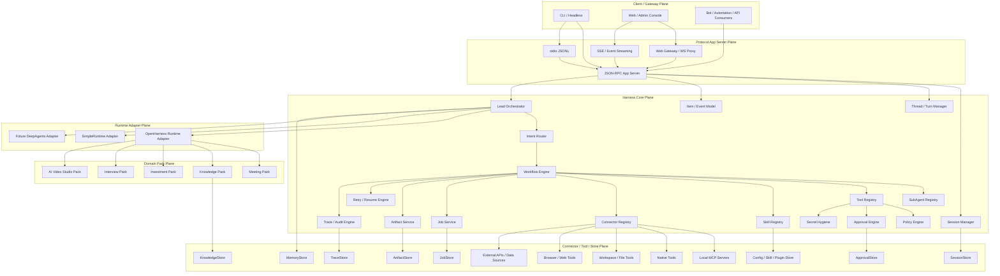

# harnessOS 正式项目基线文档 v2

**文档状态**：正式基线文档（Team Baseline v2）  
**更新时间**：2026-04-28  
**适用对象**：harnessOS 开发团队、架构评审、Codex / Claude Code 等工程代理  
**文档用途**：作为当前项目的**事实基线、冻结决策、目标架构、阶段路线与修改约束**的统一输入。后续任何开发计划修订、架构调整、任务拆解，均应以本文件为优先参照。

---

## 1. 文档目的

本文档用于统一团队对 harnessOS 当前状态与未来目标的认知，并明确后续开发的边界与优先级。

本文档要解决 5 个问题：

1. 当前系统**已经真实完成**了什么。  
2. 当前系统的**架构边界**在哪里。  
3. 哪些架构决策已经**冻结**，后续不再反复讨论。  
4. 目标架构是什么，为什么不再按“单一业务助手”继续推进。  
5. Codex 或团队成员后续修改开发计划与目标架构时，必须遵守哪些约束。

**本文档不是**：
- API 最终冻结文档。  
- 详细接口字典。  
- 逐行实现说明。  
- 多业务 Pack 的详细 PRD。  

它是当前阶段的**架构与项目基线 Source of Truth**。

---

## 2. 项目定位

### 2.1 当前项目定位

harnessOS 当前不再被定义为“会议助手”或“某个业务场景的 CLI 工具”，而被定义为：

> **Protocol-first Harness Core + OS-like Agent App Server + Domain Pack Platform**

这意味着 harnessOS 的目标是：

- 以统一协议边界承载 CLI、Web、Bot、Automation 等多类客户端。  
- 以 Harness Core 承载会话、线程、执行、治理、作业、产物与存储等平台能力。  
- 以 Domain Pack 的方式承载会议、知识、投资、面试、AI 视频等业务工作流。  
- 以 Connector 的方式接入本地 MCP、原生工具、浏览器能力和外部数据源。  

### 2.2 术语定义

为避免团队沟通歧义，统一术语如下：

- **Core**：平台级通用能力，不带具体业务语义。  
- **Pack**：业务域装配单元，包含 workflow、subagent、skills、connectors、policies、artifact types。  
- **Connector**：连接本地或外部系统的能力单元，例如 MCP、浏览器、文件系统、市场数据接口。  
- **Runtime Adapter**：对具体执行内核（当前主要是 OpenHarness）的封装边界。  
- **Gateway / App Server**：统一协议入口，不承载具体业务逻辑。  
- **Artifact**：系统中的一级产出物对象，而不是“附带文件”。  
- **Job**：系统中的一级长任务对象，而不是“异步函数副产品”。

### 2.3 非目标说明

当前阶段的 harnessOS **不是**：

- 一个底层操作系统内核。  
- 一个只服务会议场景的单体应用。  
- 一个把所有业务逻辑直接写进 Gateway 的快速项目。  
- 一个一次性并行扩展多个重业务域的 SaaS 平台。  
- 一个在 Phase 3 就追求分布式复杂调度的大型系统。  

---

## 3. 已冻结架构决策（Frozen Decisions）

以下决策自本文档发布起视为**冻结决策**。除非出现重大事实变化或架构评审明确批准，否则不再反复讨论。

### F1. 协议优先
CLI、Web、Bot、Automation 必须统一通过协议层进入系统。客户端只改变 transport，不改变核心语义。

### F2. Core 不带业务
Core 只承载平台通用能力：协议、会话、线程、执行编排、治理、作业、产物、存储等。任何具体业务逻辑都不得直接写入 Core。

### F3. 新业务必须通过 Pack 接入
会议、知识、投资、面试、AI 视频等业务域一律以 Domain Pack 形式接入，不允许直接把业务逻辑散落到 Gateway、Core 或 Runtime Adapter 中。

### F4. Runtime 必须通过 Adapter 使用
当前主执行内核为 OpenHarness，但业务层不得直接绑定 OpenHarness 内部对象、消息模型或运行时细节。所有 runtime 调用都必须通过 Runtime Adapter。

### F5. 存储统一收敛
SQLite 是当前阶段的主存储收敛方向。legacy JSON / JSONL 仅保留兼容与导入作用，不再作为长期主路径继续扩展。

### F6. 高风险动作必须进入治理链路
写入、删除、发送、发布、交易、策略执行等高风险动作，必须进入 Policy / Approval / Trace / Retry 链路。禁止通过特殊路径绕过治理。

### F7. 长任务默认 Job 化
长音频分析、批量知识入库、策略回测、视频生成等长任务，默认进入 Job Service 管理，而不是继续同步塞入单个 turn。

### F8. 重要结果必须 Artifact 化
重要中间结果和最终结果必须登记为 Artifact，而不是仅返回裸文件路径或临时字符串结果。

### F9. Gateway 不承载业务逻辑
Gateway 只负责协议、鉴权、序列化、流式转发和客户端体验适配；不应继续累积业务工作流逻辑。

### F10. 任何新需求必须先归类
任何新需求在开始实现前，必须先判断它属于：
- Core  
- Pack  
- Connector  
- Runtime Adapter  
- Client / Gateway  

未归类不得直接进入开发。

---

## 4. 当前事实基线（Fact Baseline）

本节只记录**已经真实落地、可回归、可验收**的事实，不记录目标态或推测态能力。

### 4.1 当前基线版本

- **基线版本**：Baseline v1.5-E  
- **当前事实阶段**：Roadmap Phase 3-D 已完成 MVP
- **下一开发阶段**：Roadmap Phase 3-E Pack Assembly MVP

### 4.2 当前已落地能力总表

| 能力域 | 当前状态 | 备注 |
| --- | --- | --- |
| CLI / Headless | 已完成 | 支持普通 CLI、`--oh` TUI、`python3 -m cli.main run` headless 调用。 |
| API / Gateway | 已完成 MVP | 支持 FastAPI `/v1/runs`、SSE、`/v1/rpc`、stdio JSONL。 |
| Session / Turn 生命周期 | 已完成 MVP | 支持 `session.start`、`turn.start`、`turn.completed/failed/interrupted`、session 查询和 transcript replay。 |
| Meeting 场景 | 已完成 Phase 1 MVP | 可通过自然语言音频路径触发真实会议音频分析，生成 transcript、analysis、result、minutes。 |
| Artifact Registry | 已完成 MVP | 会议产物已登记为 harnessOS artifact，可通过 `artifact.list/get/read/register` 查询和读取。 |
| Lead Orchestrator | 已完成 MVP | `meeting.workflow`、`knowledge.workflow` 已通过 DomainWorkflow Registry 统一路由。 |
| Trace / Audit | 已完成 MVP | turn、workflow、artifact、approval、retry、job 等关键事件可追踪。 |
| Approval | 已完成 MVP | 支持 `approval.request/list/get/approve/reject`。 |
| Policy | 已完成 MVP | 写入、删除、发送、发布类请求会触发策略预检和审批。 |
| Retry / Resume | 已完成 MVP | policy gate 拦截后，可在 approval 通过后通过 `turn.retry` 续跑。 |
| Secret Hygiene | 已完成 MVP | 常见 API key、token、Authorization 等在持久化边界脱敏。 |
| Persistence Hardening | 已完成 MVP | 本地 JSON/JSONL 写入增加锁和原子替换，降低并发写风险。 |
| API Lifecycle | 已完成 | FastAPI route 不再持有模块级 `_gateway` 单例，改为 app-scoped DI。 |
| Core Protocol / Store | 已完成 MVP | 已定义 Session、Thread、Turn、Item、Job、Artifact、Approval、Trace、Retry、Connector 等核心对象，并引入 SQLite Store。 |
| Pack System | 已完成 MVP | meeting、knowledge 为 active pack；investment、interview、video_studio 为 stub pack。 |
| Job / Background Worker | 已完成 MVP | 会议 workflow 会创建 job 并关联 artifact、trace、turn；本地 in-process worker、job events、failure_context 和 cancel 终态语义已落地。 |
| Tool Policy Middleware | 已完成 MVP | builtin tools 与 Core engine tool loop 可在真实执行前阻断未审批高风险工具。 |
| Runtime Adapter | 已完成 MVP | Gateway 通过 RuntimeHandle / RuntimeAdapter 管理 SimpleRuntime 和 OpenHarness Runtime。 |
| Adapter-level Governance Injection | 已完成 MVP | Simple/OpenHarness adapter 默认路径注入 policy evaluator、approval checker、trace context 和 tool metadata。 |

### 4.3 当前“已完成”与“已完成 MVP”的边界说明

为避免误解，统一口径如下：

- **已完成**：已经是当前主路径的一部分，可作为默认架构路径继续迭代。  
- **已完成 MVP**：能力已经存在，但还不是最终目标形态，后续仍需继续产品化/平台化。  

因此，下列能力虽然“已完成 MVP”，但**不得被误认为已经产品化完成**：

- Pack System  
- Job Service  
- Tool Policy Middleware  
- Runtime Adapter  
- Session / Turn / Transcript 的 Core-native 查询能力  

### 4.4 当前最重要的端到端验收样本

当前最重要的现实验收样本仍然是：**会议真实音频分析**。

建议统一团队样本路径约定，不再使用个人机器路径。

标准样本建议约定为：

```text
fixtures/audio_samples/
```

标准验收命令建议约定为：

```bash
python3 -m cli.main run --json \
'请分析 ./fixtures/audio_samples/sample_ted_talk.mp3，生成会议纪要'
```

预期结果：

- 返回会议分析完成信息。  
- 生成会议主题、转写字数、分段数量。  
- 返回 `minutes.md` 路径。  
- 返回 `analysis/result/transcript/minutes` 四类 artifacts。  
- Core 中形成 `session / thread / turn / items / trace / job / artifact` 关联链路。  

### 4.5 当前测试基线

当前阶段的事实基线必须至少满足：

- 会议真实音频端到端不回归。  
- 现有 CLI / RPC / SSE / stdio 路径不回归。  
- 高风险工具阻断路径不回归。  
- Artifact / Trace / Approval / Retry 主链路不回归。  

---

## 5. 当前架构基线说明

当前系统已经从单入口 CLI 工具逐步扩展为多入口 Gateway 架构。

```text
CLI / TUI / Headless
        |
FastAPI / SSE / JSON-RPC / stdio JSONL
        |
apps.gateway
        |
Lead Orchestrator + DomainWorkflow Registry
        |
Runtime Adapter + Tool Registry + Policy Middleware
        |
OpenHarness Runtime / SimpleRuntime / Meeting MCP / Native Tools
        |
Core SQLite Store + legacy JSON/JSONL compatibility
```

### 5.1 当前架构的核心事实

1. `apps/gateway` 仍是主要协议边界和运行时协调层。  
2. `core.protocol`、`core.stores`、`CoreAppService` 已开始承担 Core-native 数据模型与持久化职责。  
3. Meeting 能力来自相邻项目 `meeting-voice-assistant` 的 MCP 服务，harnessOS 通过 Gateway workflow 调用。  
4. meeting / knowledge 已被抽象为 manifest-backed pack，但 pack 目前主要提供可见性、元数据和 workflow 关联，尚未完成完整装配驱动。  
5. Job 已具备本地 in-process worker、状态事件、failure_context 和 cancel 终态语义，但还不是分布式后台任务队列。  
6. Runtime Adapter 已收敛 Gateway 到 runtime 的调用边界，adapter 级治理上下文注入已完成 MVP；工具层自动 approval request 尚未完成。  

### 5.2 当前架构边界（必须遵守）

| 层 | 当前应负责 | 当前不应负责 |
| --- | --- | --- |
| Gateway | transport、auth、serialization、stream proxy、client experience binding | 继续新增业务 workflow 逻辑 |
| Core | protocol objects、session/thread/turn、policy、approval、job、artifact、workflow orchestration | 前端渲染、页面逻辑 |
| Runtime Adapter | 封装 OpenHarness / SimpleRuntime，统一执行接口 | 对外协议定义 |
| Pack | domain workflow、subagent、skill、connector、policy bundle | 平台通用逻辑 |
| Connector | 本地 MCP / 本地服务 / 原生工具 / 外部接口的接入 | 业务编排 |
| Store | 状态持久化与查询 | 业务判断 |

---

## 6. 目标架构（Target Architecture）

目标架构已采纳 `docs/history/design/V2.0/harnessos_architecture_master_spec_v2.md` 的主干思想，当前统一表述如下：

```text
Client / Gateway Plane
  CLI / Web / Bot / Automation

Protocol App Server Plane
  JSON-RPC / SSE / stdio JSONL / Web Gateway

Harness Core Plane
  Session / Thread / Turn / Item
  Workflow / SubAgent / Tool / Skill / Connector Registry
  Policy / Approval / Retry / Trace / Secret Hygiene
  Job Service / Artifact Service

Runtime Adapter Plane
  OpenHarness Adapter
  SimpleRuntime Adapter
  Future DeepAgents Adapter

Domain Pack Plane
  Meeting / Knowledge / Investment / Interview / Video Studio

Connector / Tool / Store Plane
  Local MCP Servers / Native Tools / File Tools / Browser / External APIs
  SQLite first, future pluggable stores
```

### 6.1 目标架构图



### 6.2 目标架构原则

#### P1. 协议优先
CLI、Web、Bot、自动化脚本只是 transport 不同，语义必须统一。

#### P2. Core 不带业务
Core 提供运行时、协议、治理、Store、Job、Artifact、Trace 等平台能力；业务通过 Pack 接入。

#### P3. Pack 可装配
装配不同 Pack，使 harnessOS 具备不同业务工作流。会议、知识、投资、面试、视频创作都应通过 pack manifest 声明 workflow、connector、skill、policy、artifact kind。

#### P4. Runtime 可替换
OpenHarness 是当前主要 runtime，但业务层不能直接绑定 OpenHarness 内部对象；必须通过 Runtime Adapter。

#### P5. 治理深入执行层
Policy 不只做 turn preflight，还要覆盖 tool invocation、job execution、artifact persistence、retry / resume。

#### P6. 长任务进入 Job Service
会议音频分析、策略回测、视频生成、批量知识入库等都应进入统一 Job 状态机和事件链路。

#### P7. 关键对象可追踪
Session、Thread、Turn、Item、Job、Artifact、Approval、Trace、Retry、Connector 都是一级对象。

---

## 7. Domain Pack 目标形态

未来业务能力不应再直接写死在 Core 中，而应以 Domain Pack 的方式装配。

### 7.1 Pack 定义

Pack 不是单纯目录，也不是一个 manifest 文件。Pack 是**一组可装配业务能力的发布单元**，至少应包含：

- manifest  
- workflows  
- subagents  
- skills  
- connectors  
- policies  
- artifact kinds  
- examples / tests  

### 7.2 Pack 结构建议

```text
packs/
  <pack_name>/
    manifest.yaml
    workflows/
    subagents/
    skills/
    connectors/
    policies/
    artifact_types/
    prompts/
    examples/
```

### 7.3 当前与未来 Pack 列表

| Pack | 当前状态 | 目标 |
| --- | --- | --- |
| meeting | active MVP | 成为完整装配样板 pack |
| knowledge | active MVP | 成为第二个完整装配样板 pack |
| investment | stub | 未来用于资产管理、投资建议、仓位、回测 |
| interview | stub | 未来用于面试流程管理、模拟面试、技能学习 |
| video_studio | stub | 未来用于 AI 视频创作工作流、多 Agent 工位协作 |

---

## 8. Connector / Tool / Store Plane 目标形态

### 8.1 目标

Connector / Tool / Store Plane 必须成为一级平台层，统一管理：

- Local MCP Servers  
- Native Tools  
- Workspace / File Tools  
- Browser / Web Tools  
- External APIs / Data Sources  

### 8.2 当前问题

当前 meeting MCP 仍然存在相邻项目路径逻辑与环境耦合，这在未来扩展 investment / video 等场景时会变成严重风险。

### 8.3 目标要求

所有 Connector 必须：

- 通过 Connector Registry 注册  
- 支持 `connector.list / get / health` 语义  
- 支持配置引用（config ref）而不是硬编码路径  
- 支持能力发现（capabilities）  
- 能与 Trace / Approval / Job / Artifact 绑定  

---

## 9. 当前架构与目标架构的主要差距

| 方向 | 当前状态 | 目标状态 | 差距 |
| --- | --- | --- | --- |
| 协议层 | `/v1/runs`、SSE、`/v1/rpc`、stdio JSONL 可用 | Codex-style App Server 级协议边界 | method / event / error code 还未正式冻结。 |
| Store | Core SQLite 已引入，legacy JSON/JSONL 仍保留 | Core Store 成为主路径，legacy 仅兼容导入 | `session.events / transcript` 等仍需进一步 Core-native。 |
| Job | 本地 in-process worker、job events、failure_context、cancel 终态语义已完成 MVP | 长任务统一进入 Job Service，未来可扩展进度、resume 和外部 worker | 仍缺可恢复 resume、细粒度 progress 和多 worker 调度；分布式队列当前非目标。 |
| Pack | manifest 可见，meeting/knowledge active | Pack 驱动 workflow / connector / skill / policy 装配 | Pack Assembly 尚未完成。 |
| Connector | Meeting MCP 仍有相邻项目路径逻辑 | Connector Registry 管理 MCP、健康检查、配置引用 | 缺 `connector.list/get/health` 和 connector scope。 |
| Runtime Adapter | Gateway 已通过 adapter 调用 runtime，并完成 adapter-level governance injection MVP | Adapter 默认注入 policy、approval、trace、tool metadata | 已完成 MVP；工具层自动 approval request 仍需后续治理增强。 |
| 治理 | preflight、approval、retry、tool policy MVP 已完成 | turn/tool/job/artifact/retry 全链路一致治理 | 工具层自动创建 approval、job/artifact 治理仍需补齐。 |
| 多业务迁移 | meeting/knowledge 已落地，其他 pack 为 stub | investment、interview、video_studio 可独立 pack 装配 | 需要先完成 Core/Pack/Connector 基建，再扩展新业务。 |

---

## 10. 当前主要架构风险

当前没有必须推翻重做的重大架构风险，但以下风险必须在 Phase 3 中显式解决。

| 风险 | 影响 | 缓解方向 |
| --- | --- | --- |
| Gateway 与 Core 职责重叠 | 后续功能可能继续写回 Gateway，导致 Core 平台化失败 | 持续将 session / event 查询和写入迁移到 Core-native。 |
| Pack 只是 manifest | 多业务迁移时仍可能把业务逻辑写死在 Core / Gateway | 做 Pack Assembly，让 pack 驱动 workflow / connector / skill / policy 注册。 |
| Job worker 仍是本地 in-process MVP | 长音频、回测、视频生成已有本地 worker 基础，但还不是分布式队列或多 worker 调度 | Phase 4 前继续以本地优先为主；分布式调度仍是非目标。 |
| Connector 未一级化 | Meeting MCP、未来投资数据源、视频工具可能分散硬编码 | 建立 Connector Registry 和 health check。 |
| 治理注入不完整 | adapter 默认路径已注入治理上下文，但工具层自动 approval request 尚未完成 | 后续治理增强阶段补齐 tool/job/artifact 全链路自动审批与审计。 |
| 命名空间兼容包较多 | `openharness.*` 与兼容路径长期并存可能造成事件类型 / 导入混乱 | 后续按 adapter 和 facade 逐步收敛，不做一次性大搬迁。 |

---

## 11. 后续开发路线（Roadmap Baseline）

### 11.1 当前路线图口径

当前 Phase 1、Phase 2 和 Phase 3-A 已完成 MVP，不再作为主线开发阶段。后续路线从 **Phase 3-B** 继续。

### 11.2 路线图总表

| 阶段 | 目标 | 验收重点 |
| --- | --- | --- |
| Phase 3-B | Core-native Session / Event Store | session、thread、turn、items、events、transcript 可从 Core records 查询或重建；会议真实音频不回归。 |
| Phase 3-C | Background Job Worker | 已完成 MVP：本地 in-process worker、job events、cancel、failure_context 可用；会议分析 job 关联 artifacts。 |
| Phase 3-D | Adapter-level Governance Injection | OpenHarness / Simple runtime 默认携带 policy、approval、trace、tool metadata；未审批高风险工具不能执行。 |
| Phase 3-E | Pack Assembly MVP | meeting / knowledge 由 pack manifest 装配 workflow / connector / skill / policy；stub pack 结构一致。 |
| Phase 3-F | Connector Registry MVP | Meeting MCP 作为 connector 注册；支持 list / get / health；缺依赖时返回可解释错误。 |
| Phase 4 | 新业务 Pack 扩展 | 优先选择 Video Studio Pack 或 Investment Pack 之一，不并行扩散。 |

### 11.3 Phase 4 前置条件

Phase 4 之前，必须满足：

- Phase 3-B 到 Phase 3-F 全部完成。  
- Pack Assembly 可运行。  
- Connector Registry 可发现本地服务。  
- Background Job Worker 可承载长任务。  
- Tool / Job / Artifact / Retry 治理链路可审计。  

---

## 12. 当前阶段的非目标（必须明确）

为避免范围失控，当前阶段明确**不做**以下事项：

1. 不做分布式集群级任务系统。  
2. 不做多租户 SaaS 化平台。  
3. 不并行推进多个新业务 Pack。  
4. 不做图形化低代码 workflow builder。  
5. 不允许新业务直接写回 Core / Gateway。  
6. 不把 OpenHarness 内部对象直接暴露为产品协议。  
7. 不在 Pack 之前提前扩展复杂业务线。  

---

## 13. 团队协作规则

从本文档发布起，团队协作必须遵循以下规则：

### R1. 新需求先归类
任何新需求开始实现前，必须明确它属于：
- Core  
- Pack  
- Connector  
- Runtime Adapter  
- Client / Gateway  

### R2. 新业务不得直接写死进 Core
任何业务语义、业务规则、业务流程必须进入对应 Pack，而不是继续写进 Gateway 或 Core。

### R3. 长任务默认 Job 化
长音频分析、策略回测、视频生成、批量知识入库等长任务，默认通过 Job Service 调度，不允许继续同步塞进单次 turn。

### R4. 重要结果默认 Artifact 化
workflow、tool、job 的重要中间结果和最终结果，默认登记为 Artifact。

### R5. 高风险动作默认进入治理链路
高风险动作必须进入 Policy / Approval / Trace / Retry，不允许旁路执行。

### R6. 每阶段都要同步更新基线
每完成一个阶段，必须同步更新：
- 当前状态  
- 目标差距  
- 测试清单  
- 手工验收脚本  
- 架构图  

---

## 14. 给 Codex 的执行约束（必须遵守）

Codex 在基于本文档修改开发计划和目标架构时，必须遵守以下约束：

1. **不得改变已冻结架构决策。**  
2. **不得把任何新业务逻辑直接写回 Core 或 Gateway。**  
3. **不得把当前 MVP 能力表述为已产品化完成能力。**  
4. **任何新开发计划必须明确归属于某个层：Core / Pack / Connector / Runtime Adapter / Client。**  
5. **任何长任务设计必须首先考虑 Job Service，而不是直接扩展同步 turn。**  
6. **任何产出物都必须考虑是否进入 Artifact Registry。**  
7. **任何高风险动作都必须说明其 Policy / Approval / Trace 路径。**  
8. **任何与 OpenHarness 绑定的实现都必须放在 Runtime Adapter 后面，而不是直接暴露。**  
9. **新的开发计划必须优先服务平台化目标，而不是优先堆叠业务功能。**  
10. **Phase 4 之前不得并行扩展多个新业务 Pack。**

---

## 15. 一句话目标（团队统一表述）

> **以 harnessOS Core 承载协议、运行时、治理、作业、产物和存储；以 Domain Pack 装配不同业务工作流；以 Connector 接入本地 MCP 和外部工具；最终让同一个 Core 支撑会议、知识、投资、面试和 AI 视频工作室等多类项目迁移。**

---

## 16. 结语

当前项目已经不再是原型阶段的单一助手，而是进入 **Core 平台化收敛阶段**。会议场景的价值在于它提供了一个真实、可端到端验收的 Domain Pack 样板，而不是未来唯一的业务方向。

从本基线文档发布起，团队后续所有开发、评审、任务拆分与计划修订，都应以：

- **冻结决策**  
- **事实基线**  
- **目标架构**  
- **阶段路线**  

作为统一参照。
