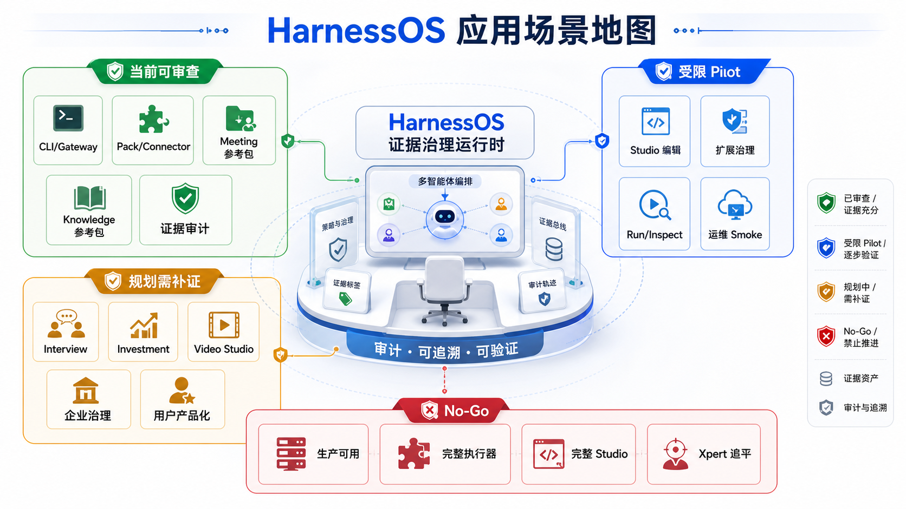

# HarnessOS Capability Boundary And Audit

## 用途、阅读对象与边界

- 用途：给 ChatGPT、DeepSeek、其他 Agent 和人类审计者提供能力矩阵、No-Go 清单和审计判断规则。
- 阅读对象：准备审查 HarnessOS 项目状态、发现过度声明、生成审计问题或复核介绍材料的人。
- 边界：本文是审计辅助文档，不是验收报告本身。最终判断必须回到 `data/project-status.json`、V12-V15/PV16 evidence package、runner output 和源代码。

## 能力矩阵

| 分类 | 能力 | 当前判断 | 证据入口 | 审计备注 |
| --- | --- | --- | --- | --- |
| 已验收 | V3.0 Multi-App Core、Pack Assembly、Connector Registry、Governed Runtime Adapter。 | 已完成 closeout / validation。 | `docs/design/V3.0/*`、`TASKS.md`。 | Meeting / Knowledge 是 reference packs，不是业务终局。 |
| 已验收 | V12 产品实体、浏览器工作台、只读画布 foundation。 | 有界审查证据完成。 | `docs/design/V12-V15.x/evidence/v12-sa-aggregate/`。 | 不证明 runtime execution 或完整 Studio。 |
| 已验收 | V13 editable Workflow Studio pilot slice。 | 有界审查证据完成。 | `docs/design/V12-V15.x/evidence/v13-workflow-studio-pilot/`。 | handoff 不发布、不运行。 |
| 已验收 | V14 governed Plugin / Skill / Tool / MCP ecosystem pilot。 | 有界审查证据完成。 | `docs/design/V12-V15.x/evidence/v14-extension-ecosystem/`。 | 不证明开放市场或任意工具执行。 |
| 已验收 | V15 frontend interaction、observability、audit、deployment smoke baseline。 | 有界审查证据完成。 | `docs/design/V12-V15.x/evidence/v15-observability-deployment/`。 | 不证明生产部署或 GA。 |
| 已验收 | PV16 product-runtime hardening pilot。 | 有界审查证据完成。 | `docs/design/V12-V15.x/evidence/post-v15-product-runtime-hardening/`。 | runtime-backed pilot 不等于完整 executor。 |
| 受限完成 | 浏览器展示真实 BFF/DTO 数据。 | V12 read-only foundation。 | route log、network log、schema validation。 | 不能写成完整产品前端。 |
| 受限完成 | Studio graph editing。 | V13 pilot。 | graph DTO、action log、WorkflowDiff handoff。 | 不能写成完整 Workflow Studio。 |
| 受限完成 | runtime-backed run/inspect。 | PV16 pilot。 | product-runtime hardening evidence。 | 不能写成完整 Agent executor。 |
| 规划中 | 完整产品入口和真实用户小工作室体验。 | 需要后续开发。 | PRD / roadmap / TASKS。 | 不能被介绍页提前确认。 |
| 规划中 | 完整多租户、权限、密钥、审计、运维和计费边界。 | 需要后续开发。 | TASKS Phase 2 / Phase 5。 | 高风险场景需独立证据。 |
| No-Go | 生产可用、Xpert 完全追平、产品级前端完成、完整 Studio、完整 Agent executor。 | 禁止正向声明。 | `data/project-status.json` no_go。 | 只能在否定或审计语境中出现。 |

## 应用场景地图



这张图是 presentation-only 场景理解素材，用来帮助审计者把应用方向按证据成熟度分层。它不是 runtime、BFF、DTO、browser E2E、生产部署或产品完成度证据。

| 场景层级 | 示例 | 审计口径 |
| --- | --- | --- |
| 当前可审查 | CLI/Gateway、Pack/Connector、Meeting 参考包、Knowledge 参考包、证据审计。 | 可回到现有 V3.0 / V12-PV16 文档和 evidence package 查证。 |
| 受限 Pilot | Studio 编辑、扩展治理、Run/Inspect、运维 Smoke。 | 只能说 pilot 或 bounded evidence，不能写成完整产品能力。 |
| 规划需补证 | Interview、Investment、Video Studio、企业治理、用户产品化。 | 属于应用前景和后续开发方向，不能当作当前已验收能力。 |
| No-Go | 生产可用、完整执行器、完整 Studio、Xpert 追平。 | 禁止作为 HarnessOS 当前正向能力声明。 |

## 阶段证明与未证明内容

| 阶段 | 证明了什么 | 没有证明什么 |
| --- | --- | --- |
| V12 | Browser workbench 可以通过 BFF-shaped DTO 展示产品实体、只读画布、Inspector、evidence refs 和 disabled reasons。 | runtime execution、完整 Workflow Studio、产品级前端完成度、Xpert parity、生产部署。 |
| V13 | 浏览器可编辑 pilot WorkflowSpecGraph，完成 graph validation、selected node inspector、WorkflowDiff review 和 confirmation handoff。 | 发布、运行、完整 Studio、自主 workflow editing、Agent executor。 |
| V14 | Plugin / Skill / Tool / MCP manifest、compatibility decision、scoped activation、unsafe denial 可审查。 | 不受限插件市场、任意 tool execution、绕过 policy 的扩展能力。 |
| V15 | trace、metrics、audit、incident、deployment smoke 的前端审查基线可用。 | 生产 GA、生产部署、完整运行时执行、完整产品交互。 |
| PV16 | durable product mutation、controlled runtime run/inspect、deployment health 和 setup-to-operations journey 的 pilot 可审查。 | 生产可用、完整 Agent executor、完整 Workflow Studio、Xpert 完全追平。 |

## No-Go 扫描清单

审计任何文档、页面、PR、报告或回答时，必须阻止以下正向声明：

- 禁止正向声明 `production ready`。
- 禁止正向声明 `Xpert parity complete`。
- 禁止正向声明 `product-grade frontend complete`。
- 禁止正向声明 `complete Workflow Studio ready`。
- 禁止正向声明 `Agent executor ready`。

允许出现的语境：

- “不要宣称 `production ready`。”
- “PV16 不证明 `Agent executor ready`。”
- “No False Green scan 阻止 `complete Workflow Studio ready` 这类正向声明。”

不允许出现的语境：任何把上述短语作为 HarnessOS 当前正向能力结论的句子。

## 展示图不等于运行证据

| 展示材料 | 正确用途 | 错误用途 |
| --- | --- | --- |
| `index.html` | 项目介绍、阅读导航、状态解释。 | 当作 browser E2E 或产品实现证明。 |
| `images/*.png` | 辅助理解能力分类、架构、旅程、生态和运维。 | 当作运行截图、DTO evidence 或 production proof。 |
| `presentation-preview.png` | 页面预览。 | 当作 UI 完成度证明。 |
| `prompts/*.md` | 图像生成提示词记录。 | 当作 PRD 验收或实现规范。 |
| `generation-log.md` | 图像生成过程记录。 | 当作 runtime 或 deployment evidence。 |

## 审计规则

1. 先读取 `data/project-status.json`，把 accepted、limited_done、planned、no_go 作为状态基线。
2. 对每个正向能力声明追溯到 evidence path、acceptance report 或 runner output。
3. 如果证据来自 `docs/present`，只能标记为介绍材料，不能标记为实现证据。
4. 如果证据来自 design prototype、Figma、高保真图或 AI 内容图，只能标记为 design-only 或 presentation-only。
5. 如果声明包含 runtime、BFF、DTO、browser E2E 或 deployment，需要对应的 route log、schema validation、network log、runner output、runtime report 或 health check。
6. 如果声明涉及生产、企业级、多租户、权限、密钥、安全、计费、SLA 或合规，需要更高标准的运行和安全证据。
7. 如果外部来源来自 MCP、LangGraph、React Flow 或 OpenAI Agents SDK，只能作为生态参考，不能提升 HarnessOS 状态。
8. 如果发现 No-Go 正向声明，应标记为 false green risk。
9. 如果发现 “pilot” 被改写成 “complete”，应要求回退到 bounded evidence wording。
10. 如果发现 “deployment smoke” 被改写成 “production deployment”，应要求补充生产证据或删除声明。

## 推荐审计问题

1. 每个正向能力声明是否都能追溯到具体 evidence path？
2. V12/V13/V14/V15/PV16 的边界是否被保留为 bounded evidence？
3. 是否把 `docs/present` 的 HTML、图片或说明文档误当作 runtime / BFF / DTO / browser E2E evidence？
4. 是否出现 No-Go 正向声明？
5. V13 的 handoff 是否被误写为 publish/run？
6. V15 的 deployment smoke 是否被误写为生产部署？
7. PV16 的 runtime-backed pilot 是否被误写为完整 Agent executor？
8. 外部生态资料是否被误写为 HarnessOS 已实现功能？
9. Meeting / Knowledge reference packs 是否被误写为平台内置业务终局？
10. 后续规划项是否被误写为当前已验收能力？

## 审计输出建议

```text
结论：PASS / PASS_WITH_NOTES / FAIL

发现：
- [严重级别] 文件或声明位置：问题描述；为什么违反边界；建议修正。

能力分类：
- 已验收：
- 受限完成：
- 规划中：
- No-Go 风险：

证据缺口：
- 声明：
- 缺少的证据：
- 推荐补证方式：
```
